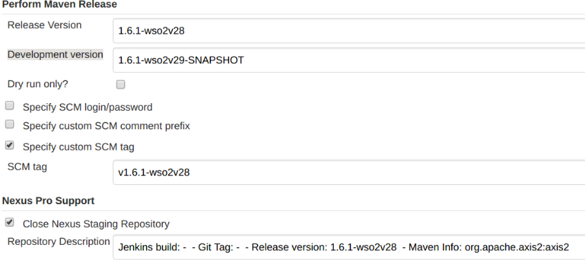

# Release Process of EI

## Dependency graph

**Note:**
 
**When updating each component Refer the dependency document \[1\]**

[1] https://docs.google.com/drawings/d/1KISypmO7qS46pAchvKsIZEN-ICyoG1hIov-krdaxAGk/edit?usp=sharing

## Axis2 Release Process

Repo: https://github.com/wso2/wso2-axis2/releases
Jenkins: https://wso2.org/jenkins/view/wso2-dependencies/job/forked-dependencies/job/wso2-axis2

Please Note:\
In maven release build Development version will be in the format \
 1.6.1-wso3v28-SNAPSHOT \
It should be changed to \
1.6.1-wso2v29-SNAPSHOT

**Sample Configuration:**

**Note:**
 
**After releasing you need to update the axis2 version in the Kernel and perform a Kernel release since axi2 is packed from Kernel.**

## Carbon Kernel Release Process - 4.4.x

1. Create new release branch ex :- release-4.4.33 (Do the below steps in this branch)

1. Prepare release with property changes (These versions are not get updated by release plugin) ex :- 
   https://github.com/wso2/carbon-kernel/pull/1811/files

1.  Generate and add license.txt. 
   Share the pack after running the maven version plugin locally
   Mail thread :- “License file for kernel release 4.4.33” 
   PR :- https://github.com/wso2/carbon-kernel/pull/1813/files 

1. Point Jenkins to the new release branch. 
   Mail thread :- “Configure Jenkins job for kernel 4.4.33 release”

1. Trigger the maven release :- https://wso2.org/jenkins/job/products/job/carbon4-kernel_4.4.x-releases/ 

1. Prepare for next dev iteration in property changes ex And Merge release branch to 4.4.x  :- 
   https://github.com/wso2/carbon-kernel/pull/1814/files
   
## Prior to kernel release we need to get a security report

Please follow the DOC:
https://docs.google.com/document/d/1kOl-zE5cS9MUpjSNDUvHVLfMPIidJ7SGHfNyv503kfI/edit#heading=h.j6y0m4h7ed5

If there are few PR’s you can check with platform security team and proceed with the release.

Mail: “Kernel Release 4.4.33” \
(Further details: NadeeshaniP or LahiruMadu)

## Axis2-Transport Release Process

Jenkins: https://wso2.org/jenkins/view/wso2-dependencies/job/forked-dependencies/job/wso2-axis2-transports/

**Note: wso2 will shown as wso3 in Development version**

## Follow the same procedure for: (Components in Same number can be parallelly released)

1. Synapse , Andes, Carbon-Commons
1. Carbon-Business-Messaging, Carbon-Data, Carbon-Business-Process, Carbon-Mediation
1. Product-EI

## After Releasing EI

1. Please refer following doc to Create Support Branches: 
https://docs.google.com/document/d/1OwrBLBO5-wQ2tUAR-GL9V090LU1Hsb62tX5uZzyHk7M/edit?usp=drivesdk

1. Add product-ei to atuwa after signing the packs: \
“Please add EI 6.3.0 to Atuwa”

1. Schedule Jenkins Jobs for support Branches:
“Scheduling Jenkins Jobs for support branches of EI-6.3.0 components”

## Mail for release vote of EI:
“[Architecture] [Dev] [VOTE] Release WSO2 Enterprise Integrator 6.3.0 RC1”

