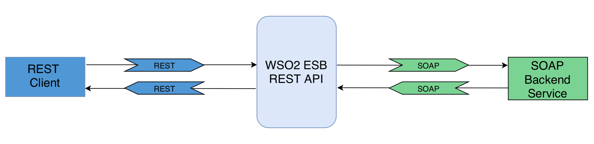

# 1.3.1 Converting JSON message to SOAP using XSLT mediator





## When to use
The reconstruction of entire message payload is needed when required format of Client and Service are different. 
In this use case we can expose a SOAP service over JSON by switching between JSON and XML/SOAP message formats 
using the [XSLT mediator](https://docs.wso2.com/display/EI640/XSLT+Mediator).


## Sample use case
Suppose a financial service company that wants to expose a set of business functionalities as a web service. 
If we have a certain stock that we are interested in, we can get the stock quote of that stock by providing its name.
  
We are going to expose this SOAP web service as a REST API by doing a JSON to SOAP conversion.

## Prerequisites
A REST client like cURL to invoke the ESB API.

## Development guidelines

<b>Proxy Configuration</b>

JSON request sent by the JSONClient will be transformed to XML representation by the proxy service.  
In the inSequence, the XSLT transformation <b>in_transform</b> apply namespace declaration
by applying namespace declarations that are expected by the service. 

Finally the [Enrich Mediator](https://docs.wso2.com/display/EI640/Enrich+Mediator) extracts the getQuote element from
the payload and attach it as the first child of the current payload.


```xml
<?xml version="1.0" encoding="UTF-8"?>
<proxy name="JSONProxy" startOnLoad="true" transports="http https" xmlns="http://ws.apache.org/ns/synapse">
    <target>
        <endpoint>
            <address format="soap11" uri="http://localhost:9000/services/SimpleStockQuoteService"/>
        </endpoint>
        <inSequence>
            <log level="full"/>
            <xslt key="in_transform"/>
            <property name="messageType" scope="axis2" type="STRING" value="text/xml"/>
            <header name="Action" scope="default" value="urn:getQuote"/>
            <enrich>
                <source clone="true" xmlns:m0="http://services.samples" xpath="//m0:getQuote"/>
                <target type="body"/>
            </enrich>
        </inSequence>
        <outSequence>
            <log level="full"/>
            <xslt key="out_transform"/>
            <property name="messageType" scope="axis2" type="STRING" value="application/json"/>
            <send/>
        </outSequence>
        <faultSequence/>
    </target>
</proxy>

```

<b>Local-entries Configurations</b>

```xml
<?xml version="1.0" encoding="UTF-8"?>
<localEntry key="in_transform" xmlns="http://ws.apache.org/ns/synapse">
    <xsl:stylesheet exclude-result-prefixes="m0 fn" version="2.0" xmlns:fn="http://www.w3.org/2005/02/xpath-functions" xmlns:m0="http://services.samples" xmlns:xsl="http://www.w3.org/1999/XSL/Transform">
        <xsl:output indent="yes" method="xml" omit-xml-declaration="yes"/>
        <xsl:template match="*">
            <xsl:element name="{local-name()}" namespace="http://services.samples">
                <xsl:copy-of select="attribute::*"/>
                <xsl:apply-templates/>
            </xsl:element>
        </xsl:template>
    </xsl:stylesheet>
</localEntry>

```

```xml
<?xml version="1.0" encoding="UTF-8"?>
<localEntry key="out_transform" xmlns="http://ws.apache.org/ns/synapse">
    <xsl:stylesheet version="1.0" xmlns:xsl="http://www.w3.org/1999/XSL/Transform">
        <xsl:output encoding="UTF-8" method="xml" version="1.0"/>
        <xsl:template match="*">
            <xsl:element name="{local-name()}">
                <xsl:apply-templates/>
            </xsl:element>
        </xsl:template>
    </xsl:stylesheet>
</localEntry>

```

Deploy the SimpleStockQuoteService in sample Axis2 server and start it on port 9000

Invoke the service with the following request. Use an HTTP client like cURL.

```xml
curl --header "Content-Type: application/json" \
--request POST \
--data '{"getQuote":{"request":{"symbol":"WSO2"}}}' \
http://localhost:8280/services/JSONProxy
```

## Deployment guidelines

* We can simply deploy by copying the CAR archive into <EI_HOME>/repository/deployment/server/carbonapps directory, and it will be deployed.

<p align="center"><b> OR </b></p>

* We can create the api in Management Console and deploy.

## REST API


## Supported versions

This is supported in all the EI and ESB versions

## Test cases

| ID        | Summary                                       |
| ----------|:---------------------------------------------:|
| 1.3.1.1   | Processing expected JSON message (Happy path) |
| 1.3.1.2   | Handling JSON message with unexpected elements|
| 1.3.1.3   | Handling malformed SOAP message               |
| 1.3.1.4   | Handling JSON message with attachments (MTOM) |
