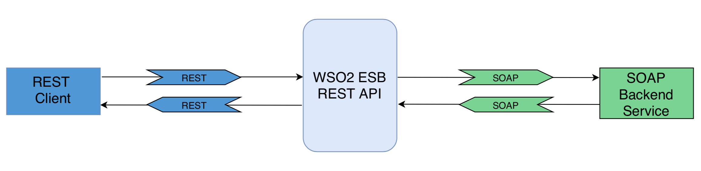

# 1.3.2 Converting JSON message to SOAP using PayloadFactory mediator





## When to use
The reconstruction of entire message payload is needed when required format of Client and Service are different. 
In this use case we can expose a SOAP service over JSON by switching between JSON and XML/SOAP message formats 
using the [PayloadFactory Mediator](https://docs.wso2.com/display/EI640/PayloadFactory+Mediator)


## Sample use case
Suppose a financial service company that wants to expose a set of business functionalities as a web service. 
If we have a certain stock that we are interested in, we can get the stock quote of that stock by providing its name.
  
We are going to expose this SOAP web service as a REST API by doing a JSON to SOAP conversion.
In this use case we can use [Property mediator](https://docs.wso2.com/display/EI640/Property+Mediator) to transform 
JSON message to SOAP.

## Prerequisites
A REST client like cURL to invoke the ESB API.

## Development guidelines

<b>Proxy Configuration</b>

JSON request sent by the JSONClient will be transformed to XML representation by the proxy service using PayloadFactory 
mediator. In the inSequence, we can configure the format of the request or response and map it to the arguments provided. 


```xml
<?xml version="1.0" encoding="UTF-8"?>
<proxy name="JSONProxy" startOnLoad="true" transports="http https" xmlns="http://ws.apache.org/ns/synapse">
    <target>
        <inSequence>
            <payloadFactory description="Build SOAP request payload" media-type="xml">
                <format>
                    <soapenv:Envelope xmlns:soapenv="http://schemas.xmlsoap.org/soap/envelope/">
                        <soapenv:Body>
                            <getQuote xmlns="http://services.samples">
                                <request>
                                    <symbol>$1</symbol>
                                </request>
                            </getQuote>
                        </soapenv:Body>
                    </soapenv:Envelope>
                </format>
                <args>
                    <arg evaluator="json" expression="$.getQuote.request.symbol"/>
                </args>
            </payloadFactory>
            <property name="SOAPAction" scope="transport" value="urn:getQuote"></property>
            <property action="remove" description="Avoid appending resource to endpoint URL" name="REST_URL_POSTFIX" scope="axis2"/>
            <send description="Send Request Payload to SOAP endpoint">
                <endpoint>
                    <address format="soap11" uri="http://localhost:9000/services/SimpleStockQuoteService"/>
                </endpoint>
            </send>
        </inSequence>
        <outSequence>
            <payloadFactory description="Build Response Payload in JSON format" media-type="json">
                <format>
                {
   "getQuoteResponse":{
      "return":{
         "change":"$1",
         "earnings":"$2",
         "high":"$3",
         "last":"$4",
         "lastTradeTimestamp":"$5",
         "low":"$6",
         "marketCap":"$7",
         "name":"$8",
         "open":"$9",
         "peRatio":"$10",
         "percentageChange":"$11",
         "prevClose":"$12",
         "symbol":"$13",
         "volume":"$14"
      }
   }
}
                </format>
                <args>
                    <arg evaluator="xml" expression="//ns:getQuoteResponse/ns:return/ax21:change" xmlns:ax21="http://services.samples/xsd" xmlns:ns="http://services.samples"/>
                    <arg evaluator="xml" expression="//ns:getQuoteResponse/ns:return/ax21:earnings" xmlns:ax21="http://services.samples/xsd" xmlns:ns="http://services.samples"/>
                    <arg evaluator="xml" expression="//ns:getQuoteResponse/ns:return/ax21:high" xmlns:ax21="http://services.samples/xsd" xmlns:ns="http://services.samples"/>
                    <arg evaluator="xml" expression="//ns:getQuoteResponse/ns:return/ax21:last" xmlns:ax21="http://services.samples/xsd" xmlns:ns="http://services.samples"/>
                    <arg evaluator="xml" expression="//ns:getQuoteResponse/ns:return/ax21:lastTradeTimestamp" xmlns:ax21="http://services.samples/xsd" xmlns:ns="http://services.samples"/>
                    <arg evaluator="xml" expression="//ns:getQuoteResponse/ns:return/ax21:low" xmlns:ax21="http://services.samples/xsd" xmlns:ns="http://services.samples"/>
                    <arg evaluator="xml" expression="//ns:getQuoteResponse/ns:return/ax21:marketCap" xmlns:ax21="http://services.samples/xsd" xmlns:ns="http://services.samples"/>
                    <arg evaluator="xml" expression="//ns:getQuoteResponse/ns:return/ax21:name" xmlns:ax21="http://services.samples/xsd" xmlns:ns="http://services.samples"/>
                    <arg evaluator="xml" expression="//ns:getQuoteResponse/ns:return/ax21:open" xmlns:ax21="http://services.samples/xsd" xmlns:ns="http://services.samples"/>
                    <arg evaluator="xml" expression="//ns:getQuoteResponse/ns:return/ax21:peRatio" xmlns:ax21="http://services.samples/xsd" xmlns:ns="http://services.samples"/>
                    <arg evaluator="xml" expression="//ns:getQuoteResponse/ns:return/ax21:percentageChange" xmlns:ax21="http://services.samples/xsd" xmlns:ns="http://services.samples"/>
                    <arg evaluator="xml" expression="//ns:getQuoteResponse/ns:return/ax21:prevClose" xmlns:ax21="http://services.samples/xsd" xmlns:ns="http://services.samples"/>
                    <arg evaluator="xml" expression="//ns:getQuoteResponse/ns:return/ax21:symbol" xmlns:ax21="http://services.samples/xsd" xmlns:ns="http://services.samples"/>
                    <arg evaluator="xml" expression="//ns:getQuoteResponse/ns:return/ax21:volume" xmlns:ax21="http://services.samples/xsd" xmlns:ns="http://services.samples"/>
                </args>
            </payloadFactory>
            <respond description="Respond to client"/>
        </outSequence>
        <faultSequence>
            <payloadFactory description="" media-type="json">
                <format>{
  "Error": {
    "message": "Error while processing the request",
    "code": "$1",
    "description": "$2"
  }
}</format>
                <args>
                    <arg evaluator="xml" expression="$ctx:ERROR_CODE"/>
                    <arg evaluator="xml" expression="$ctx:ERROR_MESSAGE"/>
                </args>
            </payloadFactory>
            <respond/>
        </faultSequence>
    </target>
</proxy>

                                
```

Deploy the SimpleStockQuoteService in sample Axis2 server and start it on port 9000

Invoke the service with the following request. Use an HTTP client like cURL.

```xml
curl --header "Content-Type: application/json" \
--request POST \
--data '{"getQuote":{"request":{"symbol":"WSO2"}}}' \
http://localhost:8280/services/JSONProxy
```

## Deployment guidelines

* We can simply deploy by copying the CAR archive into <EI_HOME>/repository/deployment/server/carbonapps directory, and it will be deployed.

<p align="center"><b> OR </b></p>

* We can create the api in Management Console and deploy.

## Supported versions
This is supported in all the EI and ESB versions

## Test cases

| ID        | Summary                                                   |
| ----------|:---------------------------------------------------------:|
| 1.3.2.1   | Converting a valid JSON message to SOAP ( Happy Path )    |
| 1.3.2.2   | Transformation of a JSON message with special characters  |
| 1.3.2.3   | Handling malformed JSON messages                          |
| 1.3.2.4   | Converting a JSON message with attachments (MTOM)         |
| 1.3.2.5   | Use payload stored in the registry as the source payload  |
| 1.3.2.6   | Converting JSON with single element arrays                |
