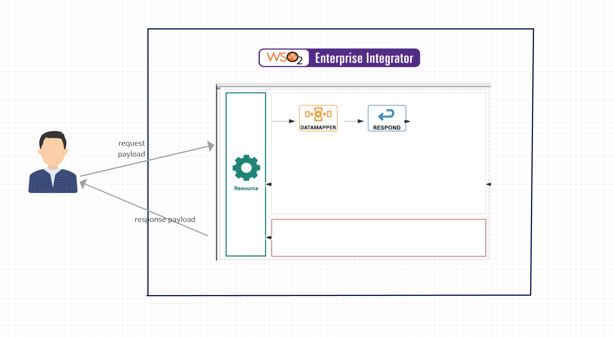
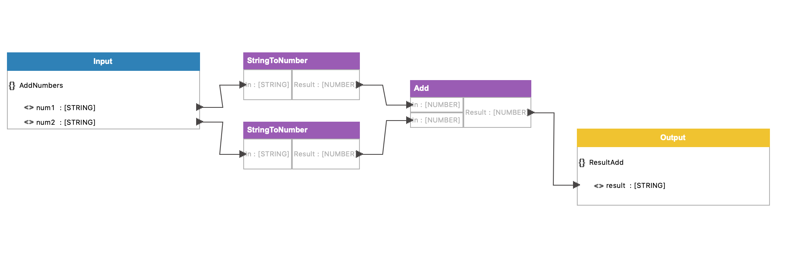
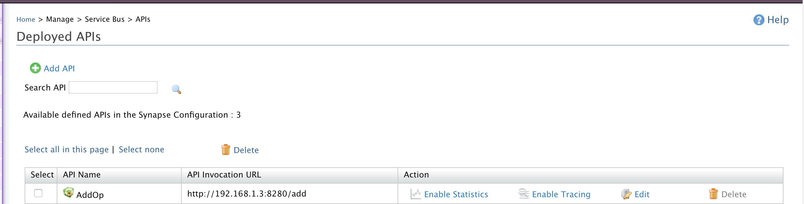
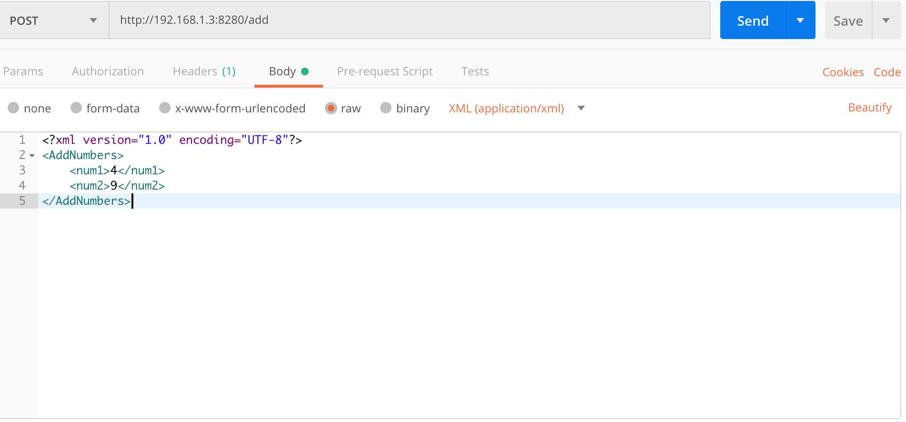

# 1.6.12 Perform Arithmetic operations in XML payload

## When to use
Data Mapper mediator is a data mapping solution that can be integrated into a mediation sequence. It converts and transforms one data format to another, or changes the structure of the data in a message. It provides a WSO2 Developer Studio-based tool to create a graphical mapping configuration and generates the files required to execute this graphical mapping configuration by the WSO2 Data Mapper engine.

## Sample use case
This use case focusses on performing addition of two numbers using datamapper mediator. 



## Prerequisites
Download WSO2 EI developer tools. 

## Development guidelines

We need to have following files provided. 
* Data Mapping Configuration   
* Input Schema
* Output Schema
* Input Type
* Output Type

1. Open the WSO2 Developer Studio.
2. Create ESB Solution Project. 
3. Right click and create a REST API. 
4. Drag and drop a Data Mapper mediator and a Respond mediator as shown in the above picture. 
5. Click on the API Resource, and then click on its Properties tab, and select True as the value for the Post method as shown below, to create the API resource listening to POST requests.
6. Double click on the Data Mapping mediator to configure it. You view a dialog box to create a registry resource project.
7. Enter a name for the configuration, and point the Registry Resource project to save it. 
8. Click OK. You view the following Data Mapper diagram editor in the new WSO2 Data Mapper Graphical perspective.
9. Create an XML file by copying the following xml file content, and save it in your local file system.

addNumbers.xml
```
<?xml version="1.0" encoding="UTF-8"?>
<AddNumbers>
    <num1>[number]</num1>
    <num2>[number]</num2>
</AddNumbers>
```

10. Right-click on the top title bar of the Input box and, click Load Input. 
11. Select XML as the Resource Type.
12. Click the file system link in Select resource from, select the XML file you saved in your local file system in step 9, and click Open.  
13. Create another XML file by copying the following sample and save it in your local file system. 

ResultAdd.xml
```
<?xml version="1.0" encoding="UTF-8"?>
<ResultAdd>
    <result>[number]</result>
</ResultAdd>
```

14. Right-click on the top title bar of the Output box and, click Load Output. 
15. Click the file system link in Select resource from, select the XML file you saved in your local file system in step 13, and click Open.  
16. Do the mapping as preferred using operators as shown in the example below.  


17. Press Ctrl+S keys in each tab, to save all the configurations. 
18. Login to WSO2 EI Management Console and deploy the carbon application to WSO2 EI. 
19. Click Main, and then click APIs in the Service Bus menu. You view the deployed  REST API invocation URL as shown below.  


API 'AddOperation' is as below. 

```xml
<api xmlns="http://ws.apache.org/ns/synapse" name="AddOp" context="/add">
   <resource methods="POST GET">
      <inSequence>
         <datamapper config="gov:datamapper/NewConfig.dmc" inputSchema="gov:datamapper/NewConfig_inputSchema.json" outputSchema="gov:datamapper/NewConfig_outputSchema.json" inputType="XML" outputType="XML"/>
         <respond/>
      </inSequence>
      <outSequence/>
      <faultSequence/>
   </resource>
</api>                          
```


## Invoking the created REST API. 
1. Follow the steps below to test invoking the created REST API.
2. Enter the following details to create the client message, 
    URL: http://<EI_HOST>:<EI_PORT>8280/addOp
    Method: POST
    Body: raw xml/application
    Message: Enter the input

    


The response will be as below. 
```
<ResultAdd>
    <result>13.0</result>
</ResultAdd>
```


## Deployment guidelines

* described in Step 18 in Development guidelines. 


## Supported versions
This is supported in all the EI and ESB versions

## Test cases

| ID        | Summary                                                  |
| ----------|:-------------------------------------------------------: |
| 1.6.12.1  | Perform add operation using datamapper mediator          |
| 1.6.12.2  | Perform substract operation using datamapper mediator    |
| 1.6.12.3  | Perform multiplication using datamapper mediator         |
| 1.6.12.4  | Perform division using datamapper mediator               |
| 1.6.12.5  | Get the ceiling value using datamapper mediator          |
| 1.6.12.6  | Get the round value using datamapper mediator            |
| 1.6.12.7  | Get the absoulte value using datamapper mediator         |
| 1.6.12.8  | Get the min value using datamapper mediator              |
| 1.6.12.9  | Get the max value using datamapper mediator              |
| 1.6.12.10 | Get the floor value using datamapper mediator            |
                                                           

You can refer more on https://docs.wso2.com/display/EI600/Using+Data+Mapper+Mediator+in+WSO2+EI#UsingDataMapperMediatorinWSO2EI-CreatingtheESBconfigurationproject 
