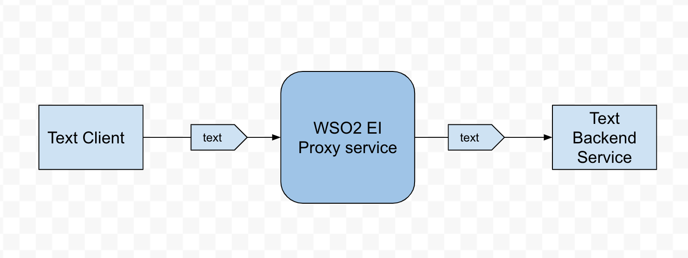

# 8.1.1 Converting plain text message to another plain text message (plain text message enrichment)

## When to use

Sometimes there is a requirement to modify a plain text message during the mediation. A typical scenario is we need to 
modify the plain text message before it is forwarded to a service and the way we want to modify it is depends on a response we receive from
some other way like another service, db call etc. This sample demonstrates how to modify a text message inside EI 
before it is sent out to a backend service. 

## Sample use case

A plain text message is received using a HTTP proxy service. It is appended by a static string before it is forwarded
to a backend service which accepts text/plain message. 

## Prerequisites

 * A REST client like cURL to invoke the EI API
 * A service accepting plain text messages

## Development guidelines

Use WSO2 EI Tooling to develop the artifacts 
 
## Deployment guidelines

Simply deploy by copying the CAR archive into <EI_HOME>/repository/deployment/server/carbonapps directory

## Supported versions

This is supported in all the EI and ESB versions

## Test cases

| ID        | Summary                                                                         |
| ----------|:-------------------------------------------------------------------------------:|
| 8.1.1.1   | Enrich a plain text message using script mediator                               |
| 8.1.1.2   | Enrich a plain text message using XPATH mediator                                |
| 8.1.1.3   | Enrich a plain text message using XSLT mediator                                 |

