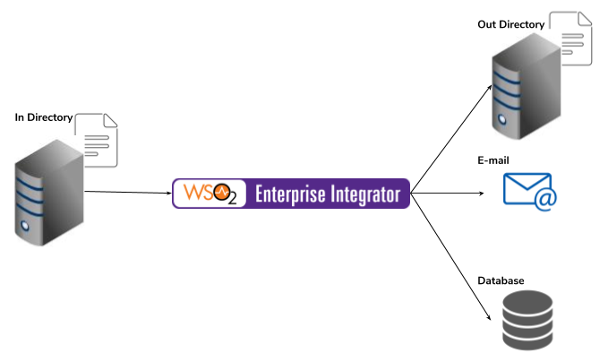

# 10 File processing

## Business use case narrative

In many business domains, there are different use cases related to managing files. Also there are file based 
legacy systems that are tightly coupled with other systems.

These files contain huge amount of data it requires huge effort for manual processing. Also it is not scalable with increase
of system load. This leads us to the requirement of automation the processing of files.

File processing system should be capable of:

- Reading, Writing and Updating files: 

Files can be located in local file system or remote location which access enabled over protocols such as FTP, FTPS, SFTP,
 SMB. Therefore the system that used to process those files should capable for communicating over those protocols.
 
- Process data

The system should capable extracting relevant information from the file. For example, if required to process XML files,
the system should be capable of executing and XPath on the file content and extract relevant information. 

- Execute some business logic 

The system should be capable perform actions that required to construct business use case. It should capable of taking 
decisions and sending processed information to other systems over different communication protocols.

The WSO2 ESB / EI has capabilities to achieve above.

## Sub-Scenarios
- [10.1 Simple file movement between two systems](10.1-simple-file-movement-between-two-systems)
- [10.2 File movement with file processing between two systems](10.2-file-movement-with-file-processing-between-two-systems)
- [10.3 Mask valuable business data stored in files](10.3-mask-valuable-business-data-stored-in-files)
