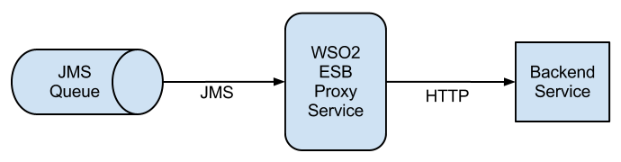

#2.2.1  Listen to a JMS queue, consume messages, and send them to a HTTP back-end service



##When to use
In this sections walk you through the steps to configure the ESB to listen to a JMS queue, consume messages, and send the messages to a HTTP back­-end service

##Sample use-case
--sample use-case

##Supported versions

##Pre-requisites
    -Configure WSO2 ESB with Apache ActiveMQ, and set up the JMS listener. For instructions, see [Configure with ActiveMQ](https://docs.wso2.com/display/ESB500/Configure+with+ActiveMQ).
    -Start the ESB server.

##Development guidelines

-Create a proxy service with the following configuration. For information on how to create a proxy service, see [Creating a Proxy Service](https://docs.wso2.com/display/ESB500/Adding+a+Proxy+Service).

```xml
<proxy xmlns="http://ws.apache.org/ns/synapse" name="JMStoHTTPStockQuoteProxy" transports="jms">
       <target>
           <inSequence>
               <property action="set" name="OUT_ONLY" value="true"/>
           </inSequence>
           <endpoint>
               <address uri="http://localhost:9000/services/SimpleStockQuoteService"/>
           </endpoint>
           <outSequence/>
       </target>
</proxy>
```

###Testing the sample

To test this sample, you need an HTTP back-end service. Let's use the SimpleStockQuoteService as the back-end service and test the sample.

    1. Follow the steps below to build and deploy the SimpleStockQuoteService:
        Open a command prompt (or a shell in Linux) and go to the <ESB_HOME>/samples/axis2Server/src/SimpleStockQuoteService directory.

        Run ant.

    2. Follow the steps below to start the Axis2 server:
        Open a command prompt (or a shell in Linux) and go to the <ESB_HOME>/samples/axis2Server directory.
        Execute one of the following commands
            On Windows: axis2server.bat
            On Linux/Solaris: ./axis2server.sh

    3. Send a message to the ActiveMQ queue by executing the following command from the <ESB_HOME>/samples/axis2Client directory.

       ```xml
        ant stockquote -Dmode=placeorder -Dtrpurl="jms:/JMStoHTTPStockQuoteProxy?transport.jms.ConnectionFactoryJNDIName=QueueConnectionFactory&java.naming.factory.initial=org.apache.activemq.jndi.ActiveMQInitialContextFactory&java.naming.provider.url=tcp://localhost:61616&transport.jms.ContentTypeProperty=Content-Type&transport.jms.DestinationType=queue"
       ```

##REST API (if available)
N/A

##Deployment guidelines
--deployment instructions--

##Test cases

| ID | Summary |
| ------------- | ------------- |
| 2.2.1.1  | Use inbound endpoint as proxy service ,Config OUT_ONLY property is set to true to indicate that message exchange is one-way    |
| 2.2.1.2  | Proxy service can listen to the queue, pick up a message and do a two-way HTTP call (OUT_ONLY property is not used.)       |
| 2.2.1.3  | Messages consumed from a queue as a SOAP message    |
| 2.2.1.4  | Messages consumed from a queue as a application/xml.       |
| 2.2.1.5  | Failover due to backend is not started and then connection refused.     |
| 2.2.1.6  | Backend is not responding then retry after given timeout period.       |