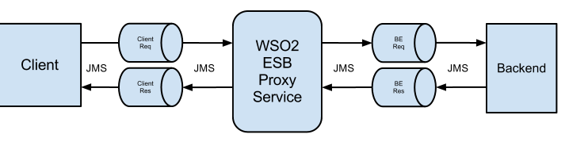

# 2.6.1 Proxy pick messages from ClientReq queue, send to backend then  response is available in BERes queue response
 message send to the client in synchronous manner. 


## When to use
Proxy pick messages from ClientReq queue, send to backend then  response is available in BERes queue response message
 send to the client in synchronous manner. 

The following diagram depicts quad-channel JMS synchronous invocations of the WSO2 EI.

 

 The message flow of the above sample configuration is as follows:

- The JMSReplyTo property of the JMS message is set to ClientRes. Therefore, the client sends a JMS message to the ClientReq queue.
- The transport.jms.ReplyDestination value is set to BERes. This enables the WSO2 EI proxy to pick messages from 
ClientReq queue, and send to BEReq queue.
- The back-end picks messages from the BEReq queue, processes and places response messages to BERes queue.
- Once a response is available in BERes queue, the proxy service picks it and sends back to ClientRes queue.
- The client picks it as the response message.

## Sample use-case

## Supported versions

## Pre-requisites
Follow the steps below to set the prerequisites up before you start.

  1. Download and set up Apache ActiveMQ. For instructions, see Installation Prerequisites. 
  2. Copy the following client libraries from the <AMQ_HOME>/lib directory to the <EI_HOME>/lib directory.   
         ActiveMQ 5.8.0 and above   
            activemq-broker-5.8.0.jar
            activemq-client-5.8.0.jar
            geronimo-jms_1.1_spec-1.1.1.jar
            geronimo-j2ee-management_1.1_spec-1.0.1.jar
            hawtbuf-1.9.jar   

         Earlier versions of ActiveMQ
            activemq-core-5.5.1.jar
            geronimo-j2ee-management_1.0_spec-1.0.jar
            geronimo-jms_1.1_spec-1.1.1.jar
            
   3. Add the following properties to the <EI_HOME>/conf/jndi.properties file. For more information, see Setting up 
   WSO2 EI and ActiveMQ.
      queue.ClientReq = ClientReq
      queue.BEReq = BEReq
      queue.BERes = BERes
      
   4. Uncomment the following sections in the <EI_HOME>/conf/axis2/axis2.xml file.
      a.To enable the JMS transport sender:
      
          <transportSender name="jms" class="org.apache.axis2.transport.jms.JMSSender"/>   
          
      b.To enable the JMS transport listener:
      
      
```xml
               <!--Uncomment this and configure as appropriate for JMS transport support, after setting up your JMS environment (e.g. ActiveMQ)--><transportReceiver name="jms" class="org.apache.axis2.transport.jms.JMSListener">
               <parameter name="myTopicConnectionFactory" locked="false">
                   <parameter name="java.naming.factory.initial" locked="false">org.apache.activemq.jndi.ActiveMQInitialContextFactory</parameter>
                   <parameter name="java.naming.provider.url" locked="false">tcp://localhost:61616</parameter>
                   <parameter name="transport.jms.ConnectionFactoryJNDIName" locked="false">TopicConnectionFactory</parameter>
                    <parameter name="transport.jms.ConnectionFactoryType" locked="false">topic</parameter>
               </parameter>
           
               <parameter name="myQueueConnectionFactory" locked="false">
                   <parameter name="java.naming.factory.initial" locked="false">org.apache.activemq.jndi.ActiveMQInitialContextFactory</parameter>
                   <parameter name="java.naming.provider.url" locked="false">tcp://localhost:61616</parameter>
                   <parameter name="transport.jms.ConnectionFactoryJNDIName" locked="false">QueueConnectionFactory</parameter>
                    <parameter name="transport.jms.ConnectionFactoryType" locked="false">queue</parameter>
               </parameter>
           
               <parameter name="default" locked="false">
                   <parameter name="java.naming.factory.initial" locked="false">org.apache.activemq.jndi.ActiveMQInitialContextFactory</parameter>
                   <parameter name="java.naming.provider.url" locked="false">tcp://localhost:61616</parameter>
                   <parameter name="transport.jms.ConnectionFactoryJNDIName" locked="false">QueueConnectionFactory</parameter>
                    <parameter name="transport.jms.ConnectionFactoryType" locked="false">queue</parameter>
               </parameter>
               </transportReceiver> 
           
  ```  
  
  - Sample configuration
  
  Following is a sample configuration of WSO2 EI for quad-channel JMS synchronous invocations.
  Example Code 
  
  ```xml
  <proxy name="QuadJMS" transports="jms" xmlns="http://ws.apache.org/ns/synapse">
        <target>
            <inSequence>
                <property action="set" name="transport.jms.ContentTypeProperty" value="Content-Type" scope="axis2"/>
                <log level="full" xmlns="http://ws.apache.org/ns/synapse"/>
                <send>
                    <endpoint>
                        <address uri="jms:/BEReq?transport.jms.ConnectionFactoryJNDIName=QueueConnectionFactory&amp;java.naming.factory.initial=org.apache.activemq.jndi.ActiveMQInitialContextFactory&amp;java.naming.provider.url=tcp://localhost:61616&amp;transport.jms.DestinationType=queue&amp;transport.jms.ReplyDestination=BERes"/>
                    </endpoint>
                </send>
            </inSequence>
            <outSequence>
                <send/>
            </outSequence>
        </target>
        <parameter name="transport.jms.ContentType">
            <rules>
                <jmsProperty>contentType</jmsProperty>
                <default>text/xml</default>
            </rules>
        </parameter>
        <parameter name="transport.jms.Destination">ClientReq</parameter>
  </proxy>
  ```

## Development guidelines

## REST API (if available)
N/A

## Deployment guidelines

## Test cases

| ID | Summary |
| ------------- | ------------- |
| 2.6.1.1  | Quad Channel JMS-to-JMS    |
| 2.6.1.2  | Failover due to backend is not started and then connection refused.   |
| 2.6.1.3  | Backend is not responding retry after given timeout period.  |
