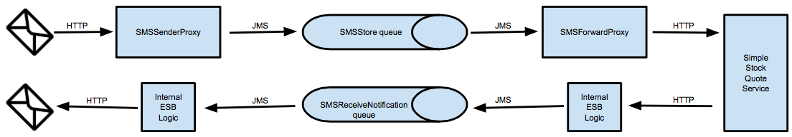

# 2.6.2 Proxy service receives an HTTP request, it publishes that request in a JMS queue. Another proxy service subscribes to messages published in this queue and forwards them to a back-end. Response received to client vice versa.

## When to use
Proxy service receives an HTTP request, it publishes that request in a JMS queue. Another proxy service subscribes to messages published in this queue and forwards them to a back-end. Response received to client vice versa.
 
A JMS synchronous invocation takes place when a JMS producer receives a response to a JMS request produced by it when
 invoked. WSO2 EI uses an internal JMS correlation ID to correlate the request and the response. See [JMS 
 Request/Reply Example](https://www.enterpriseintegrationpatterns.com/patterns/messaging/RequestReplyJmsExample.html) for more information.

JMS synchronous invocations are further explained in the following use case. 



When the proxy service named SMSSenderProxy receives an HTTP request, it publishes that request in a JMS queue named SMSStore. Another proxy service named SMSForwardProxy subscribes to messages published in this queue and forwards them to a back-end service named SimpleStockQuoteService. When this back-end service returns an HTTP response, internal logic
is used to save that message as a JMS message in a JMS queue named SMSReceiveNotification. Then this response is 
taken from the SMSReceiveNotification queue and delivered to the client as an HTTP message using internal integrator 
logic.
 
## Sample use-case

## Supported versions

## Pre-requisites

Before executing this use case, the following steps need to be carried out. See Integrating WSO2 EI in MB 
Documentation for detailed instructions.

- WSO2 MB should be installed and set up. See Setting up WSO2 Message Broker.
- WSO2 EI should installed and set up. See Setting up WSO2 EI. Specific entries that are required to be added to the 
<EI_HOME>/conf/jndi.properties file for this use case are as follows. 

Configuring the JMS publisher

Configure a proxy service named SMSSenderProxy as shown below to accept messages sent via the HTTP transport, and to place those messages in the SMSStore queue in WSO2 MB. 

```xml
<proxy xmlns="http://ws.apache.org/ns/synapse"
       name="SMSSenderProxy"
       transports="https,http"
       statistics="disable"
       trace="disable"
       startOnLoad="true">
   <target>
      <inSequence>
         <property name="transport.jms.ContentTypeProperty"
                   value="Content-Type"
                   scope="axis2"/>
      </inSequence>
      <outSequence>
         <property name="TRANSPORT_HEADERS" scope="axis2" action="remove"/>
         <send/>
      </outSequence>
      <endpoint>
         <address uri="jms:/SMSStore?transport.jms.ConnectionFactoryJNDIName=QueueConnectionFactory&amp;java.naming.factory.initial=org.wso2.andes.jndi.PropertiesFileInitialContextFactory&amp;java.naming.provider.url=conf/jndi.properties&amp;transport.jms.DestinationType=queue&amp;transport.jms.ReplyDestination=SMSReceiveNotificationStore"/>
      </endpoint>
   </target>
   <description/>
</proxy>
```
The endpoint of this proxy service uses the following properties to map the proxy service with WSO2 MB.
 
- Since this is a two-way invocation, the OUT_ONLY property is not set in the In sequence. 

Configuring the JMS consumer

- Configure a proxy service named SMSForwardProxy to consume messages from the SMSStore queue in WSO2 MB and forward them to the back-end service.    

```xml
<proxy xmlns="http://ws.apache.org/ns/synapse"
       name="SMSForwardProxy"
       transports="jms"
       statistics="disable"
       trace="disable"
       startOnLoad="true">
   <target>
      <inSequence>
         <send>
            <endpoint>
               <address uri="http://localhost:9000/services/SimpleStockQuoteService"/>
            </endpoint>
         </send>
      </inSequence>
      <outSequence>
         <send/>
      </outSequence>
   </target>
   <parameter name="transport.jms.ContentType">
      <rules>
         <jmsProperty>contentType</jmsProperty>
         <default>text/xml</default>
      </rules>
   </parameter>
   <parameter name="transport.jms.ConnectionFactory">myQueueConnectionFactory</parameter>
   <parameter name="transport.jms.DestinationType">queue</parameter>
   <parameter name="transport.jms.Destination">SMSStore</parameter>
   <description/>
</proxy>
```
Start the back-end service

The back-end service is started as follows.

- Execute the following command from the <EI_HOME>/samples/axis2Server directory.
- For Windows: axis2server.bat
- For Linux: axis2server.sh
- Execute the ant command from <EI_HOME>/samples/axis2Server/src/SimpleStockQuoteService directory.

Invoke the JMS publisher

Execute the following command from the <EI_HOME>/sample/axis2Client  directory to invoke the SMSSenderProxy proxy 
service you defined as the JMS publisher.
```xml
ant stockquote -Daddurl=http://localhost:8280/services/SMSSenderProxy -Dsymbol=IBM
```
You will get the following response.

```xml
Standard :: Stock price = $149.43669233447662
```

## Development guidelines

## REST API (if available)
N/A

## Deployment guidelines


```xml

```

## Test cases

| ID | Summary |
| ------------- | ------------- |
| 2.6.1.1  | Dual Channel HTTP-to-JMS   |
| 2.6.1.2  | Failover due to backend is not started and then connection refused.   |
| 2.6.1.3  | Backend is not responding retry after given timeout period.  |
