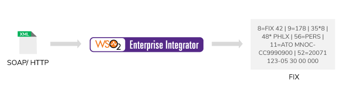

# 2-Bridging systems that communicate in different protocols (Protocol translation)

## Business use case narrative

The enterprise integrator has to offer a wide range of integration capabilities from simple message routing to 
complicated systems which use integrated solutions. Different applications typically use different protocols for  
communication. Therefore, for two systems to successfully communicate, we should translate the protocol (that pass  
from one system) to the protocol compatible with the receiving application.

A useful feature of the WSO2 Enterprise Integrator is the ability to switch protocols.
We can take a message that comes in via HTTP and send it out to a JMS queue. Another example that demonstrates the power
of this together with the previous Feature transformations - is the ability to take messages that come in from one A protocol like HTTP,
take the business content of this message and send this content Out in a completely different message format and protocol.

## Sub-Scenarios

- [2.1-HTTP-to-HTTP-protocol-translation](https://github.com/wso2/product-ei/tree/product-scenarios/product-scenarios/2-Bridging-systems-that-communicate-in-different-protocols/2.1-HTTP-to-HTTP-protocol-translation)
- [2.2-JMS-to-HTTP-protocol-translation-EI-as-JMS-consumer](https://github.com/wso2/product-ei/tree/product-scenarios/product-scenarios/2-Bridging-systems-that-communicate-in-different-protocols/2.2-JMS-to-HTTP-protocol-translation-EI-as-JMS-consumer)
- [2.3-HTTP-to-JMS-protocol-translation-EI-as-JMS-producer](https://github.com/wso2/product-ei/tree/product-scenarios/product-scenarios/2-Bridging-systems-that-communicate-in-different-protocols/2.3-HTTP-to-JMS-protocol-translation-EI-as-JMS-producer)
- [2.4-Switching-from-TCP-to-HTTP-or-HTTPS](https://github.com/wso2/product-ei/tree/product-scenarios/product-scenarios/2-Bridging-systems-that-communicate-in-different-protocols/2.4-Switching-from-TCP-to-HTTP-or-HTTPS)
- [2.5-Switching-from-UDP-to-HTTP-or-HTTPS](https://github.com/wso2/product-ei/tree/product-scenarios/product-scenarios/2-Bridging-systems-that-communicate-in-different-protocols/2.5-Switching-from-UDP-to-HTTP-or-HTTPS)
- [2.6-JMS-Synchronous-Invocations](https://github.com/wso2/product-ei/tree/product-scenarios/product-scenarios/2-Bridging-systems-that-communicate-in-different-protocols/2.6-JMS-Synchronous-Invocations)
- [2.7-FTP-transport-listener-to-mail-transport-sender](https://github.com/wso2/product-ei/tree/product-scenarios/product-scenarios/2-Bridging-systems-that-communicate-in-different-protocols/2.7-FTP-transport-listener-to-mail-transport-sender)
- [2.8-Proxy-Services-with-the-MailTo-Transport](https://github.com/wso2/product-ei/tree/product-scenarios/product-scenarios/2-Bridging-systems-that-communicate-in-different-protocols/2.8-Proxy-Services-with-the-MailTo-Transport)
- [2.9-Integration-with-systems-that-communicate-domain-specific-protocols](https://github.com/wso2/product-ei/tree/product-scenarios/product-scenarios/2-Bridging-systems-that-communicate-in-different-protocols/2.9-Integration-with-systems-that-communicate-domain-specific-protocols)
- [2.10-Integration-with-systems-that-communicate-in-proprietary-protocols](https://github.com/wso2/product-ei/tree/product-scenarios/product-scenarios/2-Bridging-systems-that-communicate-in-different-protocols/2.10-Integration-with-systems-that-communicate-in-proprietary-protocols)
- [2.11-Integration-with-systems-communicate-in-non-standard-protocols](https://github.com/wso2/product-ei/tree/product-scenarios/product-scenarios/2-Bridging-systems-that-communicate-in-different-protocols/2.11-Integration-with-systems-communicate-in-non-standard-protocols)
