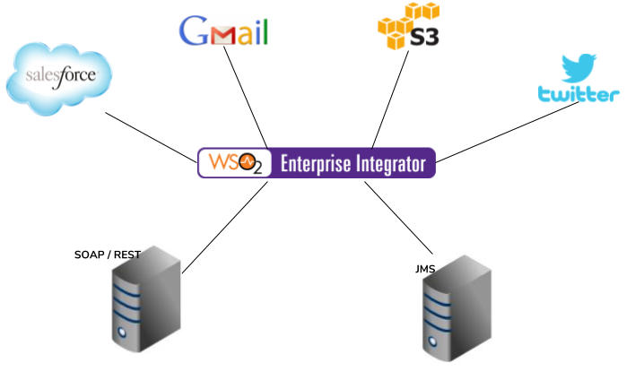

# 3 Connecting Web APIs/Cloud Services

## Business use case narrative

One of the most expected features from an integration solution is 'Hybrid Cloud Integration' i.e., the ability to 
connect to third party applications via public APIs that are exposed by the application developers where, the external 
applications could either be in the cloud (SaaS) or on premise. WSO2 Integrator brings you in this capability by means 
of it's customized connectors which, by number exceeds 150. 

A connector is a collection of templates that define operations users can call from their synapse configurations to 
easily access specific logic for processing messages. Generally, a connector wraps the API of an external service. Each 
connector is designed to work with a dedicated service hence cannot be used across services. 

WSO2 EI supports the complete list of connectors provided with WSO2 ESB where the connectors for salesforce, gmail, 
amazon S3, twitter and jira are among the most popular. Connectors can be downloaded from 
[WSO2 connector store.](https://store.wso2.com/store) It is also possible to write your own custom  connector to
integrate WSO2 EI with a service. All you need to do is to implement the connector, add it and enable it in 
your WSO2 EI instance.

## Sub-Scenarios

- [3.1-Connect with cloud applications](3.1-connect-with-cloud-applications)
- [3.2-Connect on premise and cloud based systems](3.2-connect-on-premise-and-cloud-based-systems)