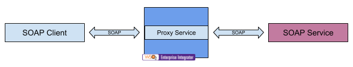
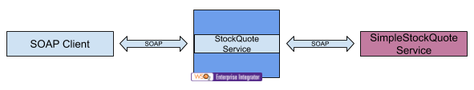

# 4.1.1.1 Expose a SOAP service as SOAP service using proxy service

## Business use case narrative



In this scenario, back-end SOAP service is exposed as SOAP service as it is using proxy service in WSO2 ESB.
In this scenario, WSO2 ESB forwards messages to the back-end service without performing any processing.

To develop such pass-through scenario, users can use the "Pass-Through proxy" template available in WSO2 Enterprise 
Integrator Tooling.

## When to use
This approach can be used route message to the actual back-end without processing. In this case, ESB acts as a simple proxy.

## Sample use-case
In this sample ESB fronts SimpleStockQuote axis2 service and expose it as StockQuote service as a SOAP service.



```xml
<?xml version="1.0" encoding="UTF-8"?>
<proxy name="StockQuotation" startOnLoad="true" transports="http https" xmlns="http://ws.apache.org/ns/synapse">
    <target>
        <endpoint>
            <address uri="http://localhost:9000/services/SimpleStockQuoteService"/>
        </endpoint>
        <inSequence/>
        <outSequence>
            <send/>
        </outSequence>
        <faultSequence/>
    </target>
    <publishWSDL preservePolicy="true" uri="file:samples/service-bus/resources/proxy/sample_proxy_1.wsdl"/>
</proxy>
```

### Prerequisites
* Deploy above proxy service by creating StockQuotation.xml file with above content and copying the file to 
```<EI_HOME>/repository/deployment/server/synapse-configs/default/proxy-services/``` directory
* Start the Axis2 server and deploy the SimpleStockQuoteService if not already done. 
(Refer [Deploying sample back-end services](https://docs.wso2.com/display/EI640/Setting+Up+the+ESB+Samples#SettingUptheESBSamples-Deployingsampleback-endservices) 
for instructions to deploy back-end services for this sample)

### How to try-out sample use-case
Service can be invoked using SOAP client or HTTP client like Curl.
For WSDL of the SOAP service, go to ```http://localhost:8280/services/StockQuoteProxy?wsdl```. 
This WSDL is based on the source WSDL supplied in the Proxy Service definition and is updated to reflect the Proxy Service EPR.

Sample request for "getQuote" operation:
```text
POST http://localhost:8280/services/StockQuotation HTTP/1.1
Content-Type: text/xml;charset=UTF-8
SOAPAction: "urn:getQuote"
Content-Length: 415
Host: localhost:8280


<soapenv:Envelope xmlns:soapenv="http://schemas.xmlsoap.org/soap/envelope/" xmlns:ser="http://services.samples" 
xmlns:xsd="http://services.samples/xsd">
   <soapenv:Header/>
   <soapenv:Body>
      <ser:getQuote>
         <ser:request>
            <xsd:symbol>WSO2</xsd:symbol>
         </ser:request>
      </ser:getQuote>
   </soapenv:Body>
</soapenv:Envelope>
```

## Supported versions
This is supported in all the EI and ESB versions

## Pre-requisites


## Development guidelines


## REST API (if available)

## Deployment guidelines
Standard way of deploying a proxy service is by packaging the proxy service as a Carbon Application. Please refer 
[Creating a Proxy Service](https://docs.wso2.com/display/EI640/Creating+a+Proxy+Service) for instructions.


## Reference
[Creating a Proxy Service](https://docs.wso2.com/display/EI640/Creating+a+Proxy+Service)


## Test cases

|      ID       | Summary |
| ------------- | ------------- |
| 4.1.1.1.1     | Front the back-end using pass-through proxy template |
| 4.1.1.1.2     | Front the back-end using custom proxy template |
| 4.1.1.1.3     | Front the back-end using Log Forward proxy template |
| 4.1.1.1.4     | Front the back-end using WSDL-Based proxy proxy template |
| 4.1.1.1.5     | Front the back-end using proxy specifying service URL using named endpoint within endpoint tag under target tag |
| 4.1.1.1.6     | Front the back-end using specifying service URL using named endpoint via "endpoint" attribute in target tag |
| 4.1.1.1.7     | Publishing WSDL of the service by loading from the registry |
| 4.1.1.1.8     | Publishing WSDL of the service by loading from uri |
| 4.1.1.1.9     | Publishing WSDL of the service by loading from file system |
| 4.1.1.1.10    | Publishing WSDL of the service by providing the WSDL inline |
| 4.1.1.1.11    | Publishing WSDL of the service by loading from registry and loading imported resources by the WSDL from registry |
| 4.1.1.1.12    | Publishing WSDL of the service by loading from registry and loading imported resources by the WSDL from URI |
| 4.1.1.1.13    | Publishing original WSDL instead of generated WSDL by the proxy service by setting "useOriginalwsdl" to true |
| 4.1.1.1.14    | Publishing original WSDL instead of generated WSDL by the proxy service by setting "useOriginalwsdl" to true and disable updating the port address by setting "modifyUserWSDLPortAddress" to false |
| 4.1.1.1.15    | Mark the proxy service as faulty when WSDL is unavailable by setting "enablePublishWSDLSafeMode" to false |
| 4.1.1.1.16    | Proxy service become inaccessible when WSDL is not available when "enablePublishWSDLSafeMode" set to true |
| 4.1.1.1.17    | Display absolute path of the referred schemas of the WSDL instead of the relative paths by default |
| 4.1.1.1.18    | Display relative path of the referred schemas of the WSDL by setting "showAbsoluteSchemaURL" to false |
| 4.1.1.1.19    | Set full proxy URL as the prefix to the schema location of the imports in proxy WSDL by setting "showProxySchemaURL" true |