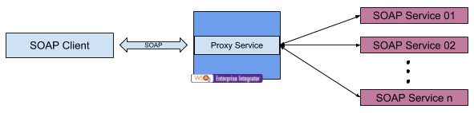

# 4.1.1.3 Expose multiple SOAP services as a single SOAP service using proxy service

## Business use case narrative

In this scenario, multiple back-end SOAP services are exposed as single SOAP service using proxy service in WSO2 ESB.
WSO2 ESB forwards messages to the relevant back-end service by processing the request. User should create new WSDL 
aggregating the operations available in each back-end WSDL and publish it as the description of the new SOAP service.

To develop this scenario, users can use the "Custom proxy" template available in WSO2 Enterprise Integrator Tooling and 
writing the mediation logic to route message to relevant back-end service using built-in mediators.

## When to use
This approach can be used when required to expose multiple SOAP services as a single SOAP service for external systems.

## Sample use-case

### Prerequisites

### How to try-out sample use-case

## Supported versions
This is supported in all the EI and ESB versions

## Pre-requisites

## Development guidelines

## REST API (if available)

## Deployment guidelines
Standard way of deploying a proxy service is by packaging the proxy service as a Carbon Application. Please refer 
[Creating a Proxy Service](https://docs.wso2.com/display/EI640/Creating+a+Proxy+Service) for instructions.

## Reference
[Creating a Proxy Service](https://docs.wso2.com/display/EI640/Creating+a+Proxy+Service)

## Test cases

|      ID       | Summary |
| ------------- | ------------- |
|  4.1.1.3.1	| Expose multiple SOAP services as a single SOAP service using proxy service by routing the message based on the soap action without payload transformation|
|  4.1.1.3.2	| Expose multiple SOAP services as a single SOAP service using proxy service by routing the message based on the soap message|
