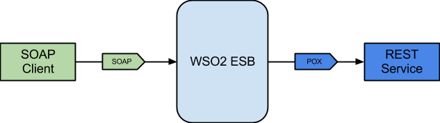

# 4.1.1.4 Expose REST back-end as a SOAP service using proxy service

## Business use case narrative

In this scenario, REST back-end is exposed as a SOAP service to SOAP client by placing WSO2 EI in the middle with a 
proxy service.

WSO2 ESB forwards messages to the back-end by transforming the message from SOAP to relevant format by using it's message
transformation capabilities. Most popular message transformations for such scenarios are:
* SOAP to POX message transformation
* SOAP to JSON message transformation

To develop this scenario, users can use the "Custom proxy" template available in WSO2 Enterprise Integrator Tooling and 
create the mediation logic to transform the message to relevant format by using built-in mediators.

## When to use
When required to expose REST API as a SOAP service.

## Sample use-case

### Prerequisites

### How to try-out sample use-case

## Supported versions
This is supported in all the EI and ESB versions

## Pre-requisites

## Development guidelines

## REST API (if available)

## Deployment guidelines
Standard way of deploying a proxy service is by packaging the proxy service as a Carbon Application. Please refer 
[Creating a Proxy Service](https://docs.wso2.com/display/EI640/Creating+a+Proxy+Service) for instructions.

## Reference
[Creating a Proxy Service](https://docs.wso2.com/display/EI640/Creating+a+Proxy+Service)

## Test cases
|      ID       | Summary |
| ------------- | ------------- |
|  4.1.1.4.1	| Expose JSON REST back-end as SOAP service |
|  4.1.1.4.2	| Expose POX REST back-end as SOAP service |
|  4.1.1.4.3	| Change HTTP method when invoking the REST back-end |
