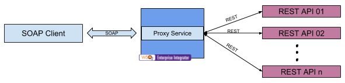

# 4.1.1.5 Expose multiple REST back-ends as a single SOAP service using proxy service

## Business use case narrative

In this scenario, multiple REST back-ends are exposed as single SOAP service to SOAP client by placing WSO2 EI in the 
middle with a proxy service.

WSO2 ESB forwards messages to the relevant back-end service by processing the request. User should create new WSDL 
with operations supported by the SOAP service and publish it.

To develop this scenario, users can use the "Custom proxy" template available in WSO2 Enterprise Integrator Tooling and 
implement the mediation logic to transform the message to relevant format and route message to relevant back-end service 
using built-in mediators.

## When to use
When required to expose multiple REST APIs as single SOAP service.

## Sample use-case

### Prerequisites

### How to try-out sample use-case

## Supported versions
This is supported in all the EI and ESB versions

## Pre-requisites

## Development guidelines

## REST API (if available)

## Deployment guidelines
Standard way of deploying a proxy service is by packaging the proxy service as a Carbon Application. Please refer 
[Creating a Proxy Service](https://docs.wso2.com/display/EI640/Creating+a+Proxy+Service) for instructions.

## Reference
[Creating a Proxy Service](https://docs.wso2.com/display/EI640/Creating+a+Proxy+Service)

## Test cases
|      ID       | Summary |
| ------------- | ------------- |
|  4.1.1.5.1	| Routing to the request based on the request payload|
|  4.1.1.5.2	| Routing to the request based on the request operation / SOAP Action|