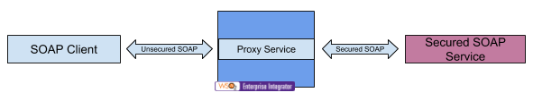

# 4.1.1.6 Expose secured SOAP back-end as open SOAP service using proxy service

## Business use case narrative



In this scenario, secured SOAP back-end is exposed as an open SOAP service to SOAP client by placing WSO2 EI in the 
middle with a proxy service.
WSO2 ESB forwards message to back-end service by applying relevant security policies.

To develop this scenario, users can use the "Custom proxy" template available in WSO2 Enterprise Integrator Tooling and 
implement the mediation logic to apply relevant security policy required by the back-end service 
using built-in mediators.

## When to use
This approach could be used to expose secured SOAP service as an open SOAP service or to invoke secured SOAP service 
within the service orchestration.

## Sample use-case
This sample demonstrates how to use the ESB to connect to endpoints with WS-Security for outgoing messages.

In this sample the stock quote client sends a request without WS-Security. The ESB is configured to enable WS-Security 
as per the policy specified in the policy_3.xml file, for outgoing messages to the SecureStockQuoteService endpoint 
hosted on the Axis2 instance.

The XML configuration for this sample is as follows: 
```xml
<definitions xmlns="http://ws.apache.org/ns/synapse">
    <localEntry xmlns="http://ws.apache.org/ns/synapse"
                key="sec_policy"
                src="file:samples/service-bus/resources/policy/policy_3.xml">
    </localEntry>
    <proxy xmlns="http://ws.apache.org/ns/synapse"
           name="InvokeSecureStockQuoteService"
           startOnLoad="true"
           statistics="disable"
           trace="disable"
           transports="http,https">
       <target>
          <inSequence>
             <send>
                <endpoint name="secure">
                   <address uri="http://localhost:9000/services/SecureStockQuoteService">
                      <enableAddressing/>
                      <enableSec policy="sec_policy"/>
                   </address>
                </endpoint>
             </send>
          </inSequence>
          <outSequence>
             <header xmlns:wsse="http://docs.oasis-open.org/wss/2004/01/oasis-200401-wss-wssecurity-secext-1.0.xsd"
                     action="remove"
                     name="wsse:Security"/>
             <send/>
          </outSequence>
       </target>
       <description/>
    </proxy>                   
</definitions>
```
This configuration file  synapse_sample_100.xml is available in the <EI_HOME>/repository/samples directory.

### Prerequisites
This sample uses Apache Rampart as the back-end security implementation. Therefore, you need to download and install 
the unlimited strength policy files for your JDK before using Apache Rampart. Follow the steps below to download and 
install the unlimited strength policy files:
* Go to [http://www.oracle.com/technetwork/java/javase/downloads/jce8-download-2133166.html], and download the 
unlimited strength JCE policy files for your JDK version.

* Uncompress and extract the downloaded ZIP file. This creates a directory named JCE that contains the 
`local_policy.jar` and `US_export_policy.jar` files.

* In your Java installation directory, go to the `jre/lib/security` directory, and make a copy of the existing 
`local_policy.jar` and `US_export_policy.jar` files. Next, replace the original policy files with the policy files 
that you extracted in the previous step.

### How to try-out sample use-case
* Start the Axis2 server. For instructions on starting the Axis2 server, see [Starting the Axis2 server](https://docs.wso2.com/display/EI640/Setting+Up+the+ESB+Samples#SettingUptheESBSamples-Axis2server).

* Deploy the back-end service  `SecureStockQuoteService`. For instructions on deploying sample back-end services, 
see [Deploying sample back-end services](https://docs.wso2.com/display/EI640/Setting+Up+the+ESB+Samples#SettingUptheESBSamples-Backend).

* The sample client used here is the Stock Quote Client, which can operate in several modes. For further details on 
this sample client and its operation modes, see [Stock Quote Client](https://docs.wso2.com/display/EI640/Using+the+Sample+Clients#UsingtheSampleClients-StockQuoteClient).

* Run the following command from the <EI_HOME>/samples/axis2Client directory.
        
    ```ant stockquote -Dtrpurl=http://localhost:8280/InvokeSecureStockQuoteService```
     
## Supported versions
This is supported in all the EI and ESB versions

## Pre-requisites

## Development guidelines

## REST API (if available)

## Deployment guidelines
Standard way of deploying a proxy service is by packaging the proxy service as a Carbon Application. Please refer 
[Creating a Proxy Service](https://docs.wso2.com/display/EI640/Creating+a+Proxy+Service) for instructions.


## Reference
[Creating a Proxy Service](https://docs.wso2.com/display/EI640/Creating+a+Proxy+Service)

## Test cases
|      ID       | Summary |
| ------------- | ------------- |
|  4.1.1.6.1	| Connect to endpoints with WS-Security for outgoing messages from a proxy service|

