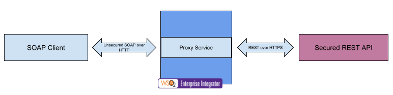

# 4.1.1.7 Expose secured REST back-end as open SOAP service using proxy service

## Business use case narrative

In this scenario, secured REST back-end is exposed as an open SOAP service to SOAP client by placing WSO2 EI in the 
middle with a proxy service.
WSO2 ESB forwards message to back-end service by applying relevant security policies.

To develop this scenario, users can use the "Custom proxy" template available in WSO2 Enterprise Integrator Tooling and 
implement the mediation logic to apply relevant security policy and message trasformation required for the back-end 
service using built-in mediators.

## When to use
This approach could be used to expose secured REST API as an open SOAP service or to invoke secured REST API 
within the service orchestration.

## Sample use-case

### Prerequisites

### How to try-out sample use-case

## Supported versions
This is supported in all the EI and ESB versions

## Pre-requisites

## Development guidelines

## REST API (if available)

## Deployment guidelines
Standard way of deploying a proxy service is by packaging the proxy service as a Carbon Application. Please refer 
[Creating a Proxy Service](https://docs.wso2.com/display/EI640/Creating+a+Proxy+Service) for instructions.

## Reference
[Creating a Proxy Service](https://docs.wso2.com/display/EI640/Creating+a+Proxy+Service)

## Test cases
|      ID       | Summary |
| ------------- | ------------- |
|  4.1.1.7.1	| Invoke REST API secured HTTPS and require Basic Authentication from a proxy service|

