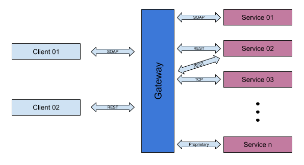

# 4.1	Extend the reach for existing applications / legacy applications

## Business use case narrative

The gateway enterprise integration pattern can be used to expose existing legacy applications as standardized services 
such as REST APIs or SOAP services by hiding the complexity introduced by existing service. 

By adhering to this pattern, using ESB, users can extend the reach to existing service over popular standard protocols.

## Sub-Scenarios

