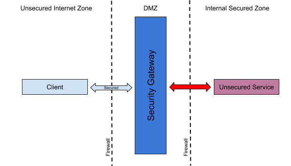

# 4.2 ESB as the security gateway

## Business use case narrative

Messaging gateways could be used to expose unsecured services as secured services.

WSO2 ESB could be used as HTTP/S or SOAP security gateway to expose internally deployed unsecured services as secured 
services to external clients by using capabilities such as SSL termination, WS-Security validation/termination, 
Client SSL certificate validation etc.

## Sub-Scenarios

