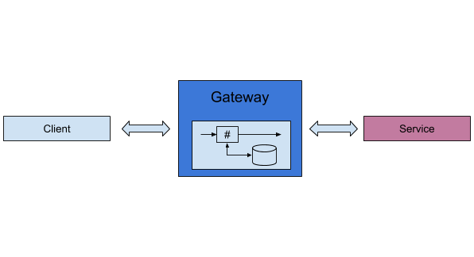

# 4.3 Using ESB as caching layer

## Business use case narrative

Caching in gateway level will improve the responsiveness of the exposed service. 

By using response caching capabilities provided in WSO2 ESB users can reduce the number of calls made to the back-end 
service improving average latency of the service and reduce the load to the back-end service.

## Sub-Scenarios

