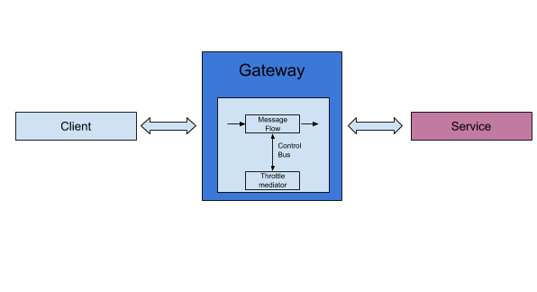

# 4.4 Protecting back-end by request throttling

## Business use case narrative

Throttling is used to in gateways to protect services from being overwhelmed by request load.

Throttling is derived from [Control Bus enterprise integration pattern](https://docs.wso2.com/display/IntegrationPatterns/Control+Bus). 

Throttling allows to limit the number of successful hits to a service during a given period of time, typically in cases 
such as the following:

- To protect your APIs from common types of security attacks such as denial of service (DOS)
- To regulate traffic according to infrastructure availability
- To make an API, application or a resource available to a consumer at different levels of service, usually for monetization purpose

WSO2 ESB provides an effective and efficient way to apply the throttle mechanism to your Web services.

## Sub-Scenarios

