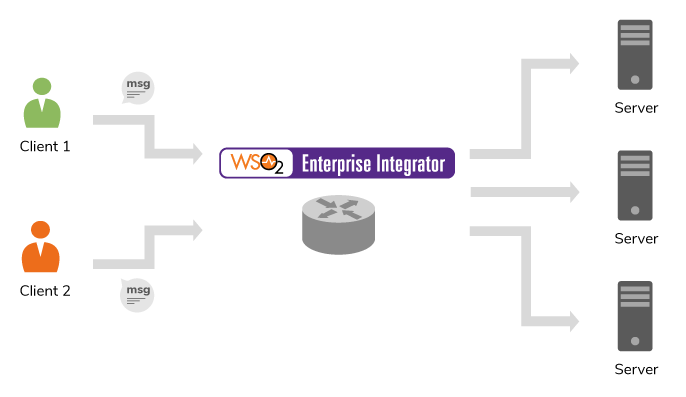

# 5.1.1.1-Using Switch mediator on given xpath

## When to use

Switch mediator behaves similar to the conventional switch-case statements available in any programming language.
Basically you can retrieve a string by calling an Xpath or JSON path query and manipulate your message by matching
the returned string within each case statement.



Given below is the syntax of this mediator.

```
<switch source="[XPath|json-eval(JSON Path)]">
   <case regex="string">
      mediator+
   </case>+
   <default>
      mediator+
   </default>
</switch>

```

Reference : [Switch Mediator](https://docs.wso2.com/display/EI610/Switch+Mediator)

## Sample use-case


## Pre-requisites


## Development guidelines


## Deployment guidelines


## Test cases

| Test Case ID  |                        Test Case	               |                                Test Description                |
| ------------- | ------------------------------------------------ | ---------------------------------------------------------------|
| 5.1.1.1.1     | Switch messages based on given Xpath with valid case name   | **_Given_:** Valid xml/json/csv request payload has be to sent. **_When_:** Add valid Xpath name as a source name in the switch mediator. **_Then_:** Valid response message should be logged when the client request is routed to the relevant endpoint. |
| 5.1.1.1.2     | [N] Switch messages based on given Xpath with Invalid case name | **_Given_:** Valid xml/json/csv request payload has be to sent. **_When_:** Add Invalid Xpath name as a source name in the switch mediator. **_Then_:** Error message should be return from the ESB.|
| 5.1.1.1.3     | [N] Switch messages based on given Xpath with null case name    | **_Given_:** Valid xml/json/csv request payload has be to sent. **_When_:** Add null Xpath name as a source name in the switch mediator. **_Then_:** Error message should be return from the ESB.|
| 5.1.1.1.4     | [N] Switch messages based on given Xpath with empty case name   | **_Given_:** Valid xml/json/csv request payload has be to sent. **_When_:** Add empty Xpath name as a source name in the switch mediator. **_Then_:** Error message should be return from the ESB.|
| 5.1.1.1.5     | Switch messages based on Xpath when multiple cases exists with a default case  | **_Given_:** Valid xml/json/csv request payload has be to sent. **_When_:** Add multiple default cases in switch mediator with valid Xpath name as a source name. **_Then_:** Valid response message should be return from the ESB.|
| 5.1.1.1.6     | Switch messages based on a given Xpath by ignoring the case sensitivity  | **_Given_:** Valid xml/json/csv request payload has be to sent. **_When_:** Add valid Xpath name with case sensitivity in the switch mediator . **_Then_:** Valid response message should be logged when the client request is routed to the relevant endpoint. |

**_Note_**
[N] Represent the Negative Test cases (incorrect behaviours that user can attempt)


