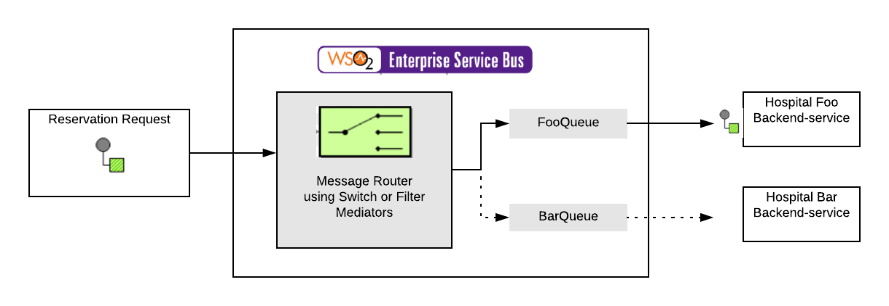

# 5.1 Route based on the content of the messages

## Business use case narrative

This sub-scenarios will cover the approaches of routing the messages into the relevant systems based
on the request content.

## Sample use case

Let's take an example of a User try to make a doctor appointment from his mobile/web application.
The user add his details, name of the doctor and the hospital name where he needs to make the reservation.
So now the request payload includes the above details. When the user sends the request,
the message is routed to the relevant endpoint by using Switch/Filter mediator.
In this example, the client can configure from which element or the attribute that the mediator should read and call the back-end service.

## Sub-Scenarios
- [5.1.1 Route messages based on the given Xpath](https://github.com/wso2/product-ei/tree/product-scenarios/product-scenarios/5-Route-messages-between-systems/5.1-Route-based-on-the-content-of-the-messages/5.1.1-Route-messages-based-on-the-given-Xpath)
- [5.1.2 Route messages based on the given regular expressions](https://github.com/wso2/product-ei/tree/product-scenarios/product-scenarios/5-Route-messages-between-systems/5.1-Route-based-on-the-content-of-the-messages/5.1.2-Route-messages-based-on-the-given-regular-expressions)
- [5.1.3 Route messages based on the request with the JSON format](https://github.com/wso2/product-ei/tree/product-scenarios/product-scenarios/5-Route-messages-between-systems/5.1-Route-based-on-the-content-of-the-messages/5.1.3-Route-messages-based-on-the-request-with-the-JSON-format)
- [5.1.4 Route messages based on the request with the CSV format](https://github.com/wso2/product-ei/tree/product-scenarios/product-scenarios/5-Route-messages-between-systems/5.1-Route-based-on-the-content-of-the-messages/5.1.4-Route-messages-based-on-the-request-with-the-CSV-format)
- [5.1.5 Route messages based on the given endpoint](https://github.com/wso2/product-ei/tree/product-scenarios/product-scenarios/5-Route-messages-between-systems/5.1-Route-based-on-the-content-of-the-messages/5.1.5-Route-messages-based-on-the-given-endpoint)
- [5.1.6 Route messages based on the conditions](https://github.com/wso2/product-ei/tree/product-scenarios/product-scenarios/5-Route-messages-between-systems/5.1-Route-based-on-the-content-of-the-messages/5.1.6-Route-messages-based-on-the-conditions)

