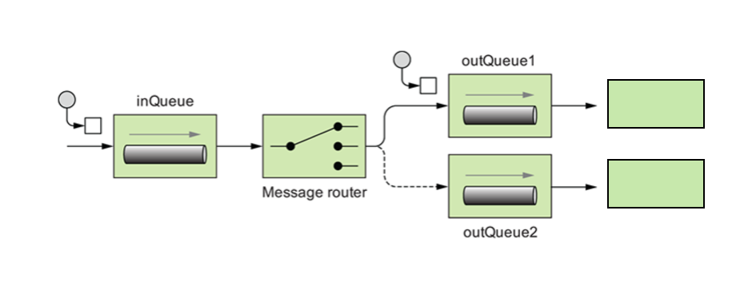

# 5. Route messages between systems

## Business use case narrative

Message Routing is related to reading the content of a message and routing it to a specific recipient based on its 
content. A message router is concerned only with redirecting messages. When there is an incoming message into WSO2  
Enterprise Integrator, it is able to determine and route the message to the recipient. Routing can also be done based
on some component of the message.

As an example, if there is a function that pass incoming request on the correct service
is distributed over to multiple systems, an incoming request needs to be passed on the correct service
based on the requested content. message router becomes quite useful in such scenarios. Requests going through the 
Enterprise Integrator are called messages, and message mediation is the main part of an integrator. The Switch and 
filter mediators of the ESB profile of WSO2EI are specifically designed for routing messages between systems.

The following diagram shows the Message Router's behavior. When it receives a request, the router reads it and forwards
the request to one of the two recipients according to the content of the message.

Reference : [Routing Requests Based on Message Content](https://docs.wso2.com/display/EI610/Routing+Requests+Based+on+Message+Content)

## Sub-Scenarios
- [5.1 Route based on the content of the messages](https://github.com/wso2/product-ei/tree/product-scenarios/product-scenarios/5-Route-messages-between-systems/5.1-Route-based-on-the-content-of-the-messages)
- [5.3 Load balance messages among two or more systems](https://github.com/wso2/product-ei/tree/product-scenarios/product-scenarios/5-Route-messages-between-systems/5.3-Load-balance-messages-among-two-or-more-systems)
- [5.4 Failover routing](https://github.com/wso2/product-ei/tree/product-scenarios/product-scenarios/5-Route-messages-between-systems/5.4-Failover-routing)
