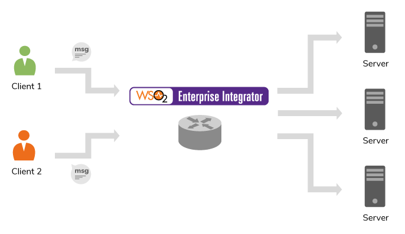

# 5.1.1.1-Using Switch mediator on given xpath

## When to use

Switch mediator behaves similar to the conventional switch-case statements available in any programming language.
Basically you can retrieve a string by calling an Xpath or JSON path query and manipulate your message by matching
the returned string within each case statement.



Given below is the syntax of this mediator.

```
<switch source="[XPath|json-eval(JSON Path)]">
   <case regex="string">
      mediator+
   </case>+
   <default>
      mediator+
   </default>
</switch>

```
Reference : [Switch Mediator](https://docs.wso2.com/display/EI610/Switch+Mediator)

## Sample use case
Let's take an example of a client that could send stock quote requests , and receive and display the price of stock quote.
The client add the name of the stock name which he needs to ge the price of the requested stock.
So now the request payload includes the above details. When the user sends the request,
the message is routed to the relevant endpoint by using Switch/Filter mediator.
In this example, the client can configure from which element or the attribute that the mediator should read and call the back-end service.

Sample request payload

```
<m:GetStockPrice xmlns:m="http://www.example.org/stock">
   <m:StockName>IBM</m:StockName>
</m:GetStockPrice>

```

Following is a sample synapse configuration in EI.

```
   <resource methods="POST">
      <inSequence>
         <property xmlns:m="http://www.example.org/stock" name="StockName" expression="//m:GetStockPrice/m:StockName" scope="default" type="STRING"/>
         <switch source="get-property('StockName')">
            <case regex="IBM">
               <call>
                  <endpoint key="http://ei-backend.scenarios.wso2.org:9090/eiTests/XMLEndpoint"/>
               </call>
            </case>
            <default/>
         </switch>
         <respond/>
      </inSequence>
      <outSequence/>
      <faultSequence/>
   </resource>
</api>

```

## Pre-requisites

A REST client like cURL to invoke the ESB API.

## Deployment guidelines

We can simply deploy by copying the carbon composite application archive into <EI_HOME>/repository/deployment/server/carbonapps directory, and it will be deployed.

**OR**

We can create the api in Management Console and deploy.

## Supported versions

This is supported in all the EI and ESB versions


