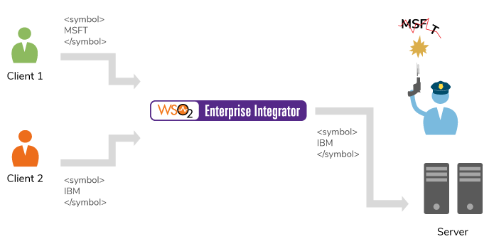

# 5.1.1.3 Using Filter Mediator on given Xpath

## Business use case narrative

Filter mediator behaves similar to the if-else logic. Filter mediator filters a message based on an XPath, JSONPath or a regular expression.
There are two modes of operation

- Specifies the XPath (boolean expression), return true or false
- XPath will be matched against the regular expression return true or false




Given below is the syntax of this mediator.

```
<filter (source="xpath" regex="string") | xpath="xpath">
  mediator+
</filter>

```

Reference : [Filter Mediator](https://docs.wso2.com/display/EI610/Filter+Mediator)

## Sample use-case


## Pre-requisites


## Development guidelines


## Deployment guidelines

