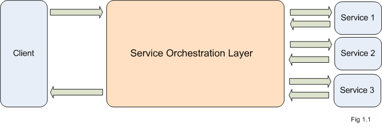

# 6. Service orchestration

## Business use case narrative

Service Orchestration is the process of accessing multiple fine-grained services from a single coarse-grained service. 
The service client would only have the visibility to a single coarse-grained service and would be encapsulated from the 
multiple fine-grained services that are invoked in the process flow.

There are two distinct types of service orchestration 

1. Synchronous service orchestration
2. Asynchronous service orchestration

Each above service orchestration approach interact services with two patterns based on the use case

1. Service chaining  
Blocking backend services would involve multiple services that are invoked as part of a sequence where one service is 
dependent on the response of the previous service. This type of backend services require the Service Orchestration Layer 
to manage and handle the service responses and use them as an input parameter for the next service. 

2. Parallel or Sequential invocation of multiple independent services  
This allows the services to be invoked simultaneously without been blocked until a response is received from another service

## Sub-Scenarios
- [6.1 Synchronous service orchestration](6.1-synchronous-service-orchestration)
- [6.2 Asynchronous service orchestration](6.2-ssynchronous-service-orchestration)

