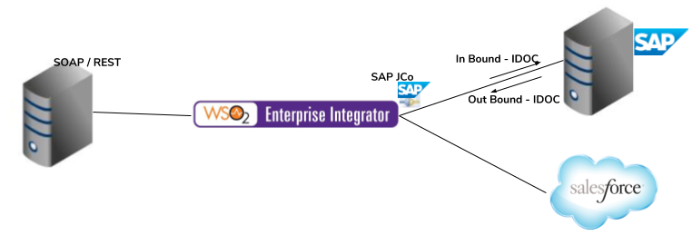

# 7. Connecting with Packaged Applications

## Business use case narrative

Packaged applications such as SAP, PeopleSoft, Salesforce drive today's business world and are considered the best of 
the breed. Such applications often use dedicated protocols to customize the communication with these systems and 
others in order to provide best customer experience along the way of being the best of the kind. It has hence become a 
necessity of enterprise integration providers to support these custom interactions out of the box.

## Persona
Developer 

## Sub-Scenarios
- [7.1 Connecting with SAP](7.1-connecting-with-SAP)
- [7.2 Connecting with Salesforce](../3-connecting-web-apis-cloud-services/3.1-connect-with-cloud-applications/3.1.2-manage-salesforce-operations)
