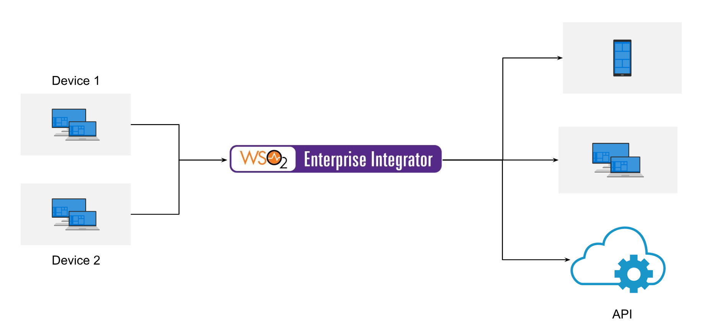

# 8-Connect devices to the enterprise

## Business use case narrative

Internet of Things (IOT) is a trending concept in IT industry. It enables connecting devices together to deliver more
seamless and intelligent  real life experience. Cloud-based Enterprise Internet of Things (IoT) platforms is making it 
possible for organizations of any size to build connected applications. 

The devices may need different information to process their work. When devices are communicating with each other, the
backend systems that facilitate connecting devices might need to modify the messages into the format required by different devices 
and add/remove information. 

MQTT (Message Queue Telemetry Transport) is a lightweight messaging protocol designed for lightweight communication between
devices and computer systems. MQTT has very low overhead in its protocol, making it ideal for computing scenarios where 
information needs to be transmitted over low-bandwidth networks or scenarios that involve a high volume of small messages. 

Thus, WSO2 EI has the capability to deal with MQTT protocol to connect to devices in enterprise. It can consume MQTT messages
modify it and send it over again. 

## Sub-Scenarios

- [Integration using MQTT protocol](8.1-Integration-with-MQTT)

