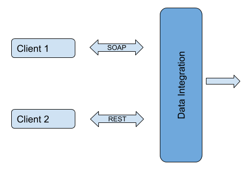

# 9.1 Bringing data from storage to screen with ease

## Business use case narrative

The data integration offers an extremely simple and user-friendly mechanism to take data and make them available as a
set of WS-* style Web services or as a set of REST style Web resources. 

## Sub-Scenarios
- [9.1.1 Expose data as a SOAP service](9.1.1-Expose-data-as-a-SOAP-service)
- [9.1.2 Expose data as a REST service](9.1.2-Expose-data-as-a-REST-service)
- [9.1.3 Receiving notifications for events](9.1.3-Receiving-notifications-for-events)
