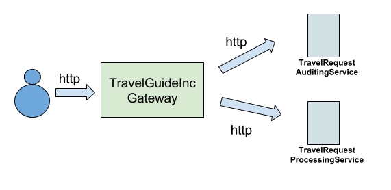

# Async Messaging Communication Patterns

## Introduction

There're several messaging domains available for asynchronous messaging

**Message queues**

Provides delivery guarantees and preserves the order of the messages. If several consumers are bound to a single queue 
only one of them would receive a given message, the messages would be load balanced among the consumers.
 
**Message topics** 

provides pub-sub based model to broadcast a given message among multiple consumers. If multiple consumers are bound 
to a topic all of them will receive a given message at any given time.
   
   - Topics could have either non-durable, durable or shared durable subscriptions.
   - Non-durable topics would deliver messages to all the available consumers, the message would be delivered based on
     "fire and forget" pattern. Where there will not be any guarantee on delivery of the message, the message will be 
     delivered based on best performance effort.
   - Durable topic subscription would ensure that the messages are delivered to the consumer/s. If a given 
     subscription is offline, the message would be persisted until the subscription becomes available.
   - Shared durable subscription would be similar to durable topics, this messaging domain would allow multiple 
     consumer groups to receive a given message. The messages will be load balanced between the consumer groups. This 
     domain has a blend of message queue and topic behaviour.
     
## What You Will Learn  
   
- Usage of queues 
- Usage of topics
- Usage of durable topics 
- HTTP to JMS protocol switching 

## Queue Usage Scenario 

### Description

TravelGuideInc intends to provide capability to its users to place travel requests via the web. Currently a Restful 
service is available to process travel requests. These requests are intended to be dispatched to 
TravelRequestProcessingService which is managed by a 3rd party travel agent. 


However, the nature of the 3rd party service (TravelRequestProcessingService) is as follows, 

 - The service becomes unavailable from time to time
 - The service cannot process more than 300 requests per second

TravelGuideInc has SLA where for its users the following should be provided,

 - 24/7 availability 
 - delivery guarantees
 - At a given time more than 500 users could place travel requests. 

By directly proxying the incoming requests to TravelRequestProcessingService would not allow TravelGuideInc to meet 
its SLAs 

### Solution

As soon as the message is received by the gateway, the message could be placed into a queue. Queue would 
ensure to persist the message and ensure that the message is successfully delivered to its consumers. 

### Building the Scenario

For this scenario we would need the following,

- Service which will act as the 
  
- Service which will act as the gateway and which will publish the message to the queue 
  
- Service which will consume the message from the queue and dispatch the message to "TravelRequestProcessingService"
   

Composing the above services queue.balx is created.

### Testing Scenario

#### Sample Setup

1. Start message broker by running the following command,

bin$ ./broker.sh

2. Deploy the service by running the following command,

bin$ ./integrator.sh ../samples/async-messaging-patterns/queue.balx


#### Invoking the service

Create a payload.json file with the following content.
```
{
   "Order":{
      "ID":"797976"
   },
   "details":{
      "Destination":"LHS to UL",
      "Date":"2017/01/31",
      "Time":"23:35",
      "SeatNumber":"14B"
   }
}
```
Invoke the service using cURL as follows

```
curl -v http://localhost:9090/travel/itinerary -d@payload.json -H"Content-Type: application/json"

```

#### Observations

The following response will be received,

```
{"Status":"travel request processed"}
```

In the service following log will be indicated,

```
Tavel order received : {"Order":{"ID":"797976"},"details":{"Destination":"LHS to UL",
"Date":"2017/01/31","Time":"23:35","SeatNumber":"14B"}}
```

The above log is indicated through the TravelRequestProcessingService.

## Topic Usage Scenario 

### Description

With time TravelGuideInc was required to audit each travel order which is dispatched to TravelRequestProcessingService.
In order to do that TravelGuideInc finance department created a service TravelRequestAuditingService. 



### Solution

With queue only one service will receive a given message. For such requirement topics should be used, so that a given
message could be broad-casted among multiple consumers.

### Building the Scenario

- Service which will act as the 
 
- Service which will act as the 
 
- Service which will act as the gateway to receive inbound http requests and dispatch them to the topic

- Service which will act as the topic consumer to dispatch to "TravelRequestProcessingService"

- Service which will act as the topic consumer to dispatch to "TravelRequestAuditingService"


Composing "TravelRequestProcessingService","TravelRequestAuditingService","TravelRequestGateway" commmon.balx is 
created.

Composing "TravelRequestProcessingConsumer" and "TravelRequestAuditingConsumer" default.balx is created.

### Testing Scenario

#### Sample Setup

1. Start message broker by running the following command,

bin$ ./broker.sh

2. Deploy the service by running the following two commands,

bin$ ./integrator.sh ../samples/async-messaging-patterns/common.balx   
bin$ ./integrator.sh ../samples/async-messaging-patterns/default.balx

#### Invoking the service

Create a payload.json file with the following content.
```
{
   "Order":{
      "ID":"797976"
   },
   "details":{
      "Destination":"LHS to UL",
      "Date":"2017/01/31",
      "Time":"23:35",
      "SeatNumber":"14B"
   }
}
```
Invoke the service using cURL as follows

```
curl -v http://localhost:9090/travel/itinerary -d@payload.json -H"Content-Type: application/json"
```

#### Observations 

In the service following log will be indicated,

```
Tavel order received : {"Order":{"ID":"797976"},"details":{"Destination":"LHS to UL",
"Date":"2017/01/31","Time":"23:35","SeatNumber":"14B"}}
Tavel order will be audited : {"Order":{"ID":"797976"},"details":{"Destination":"LHS to UL",
"Date":"2017/01/31","Time":"23:35","SeatNumber":"14B"}}
```

The above log entries are being reflected through both TravelRequestProcessingService and TravelRequestAuditingService.

## Durable Topic Usage Scenario

### Description

While using topics TravelGuideInc noticed that from time to time the services it connects becomes unavailable. Due to
this it has come to notice that some messages have got lost and TravelGuideInc could not meet the specified SLAs.

### Solution

As it was reflected at the beginning of the sample. Usage of non-durable topics would provide better performance. 
However, messages will not be persisted in this mode. Hence, if the consumers are offline the messages dispatched at 
that time will not be delivered.   

### Building the Scenario

- "common.balx" described in the section "Topic Usage Scenario" would be used in this scenario.
- Service which will create a durable topic subscription in order to dispatch the request to 
"TravelRequestProcessingService" would be 

- Service which will create a durable topic subscription in order to dispatch the request to 
"TravelRequestAuditingService" would be 


Composing the above "TravelRequestProcessingConsumer" and "TravelRequestAuditingConsumer", "durable.balx" is created.

### Testing Scenario

#### Sample Setup

1. Start message broker by running the following command,

bin$ ./broker.sh

2. Ensure to have the common.balx running, it it's not running execute the following 

bin$ ./integrator.sh ../samples/async-messaging-patterns/common.balx  

3. Deploy the service by running the following command,
 
bin$ ./integrator.sh ../samples/async-messaging-patterns/durable.balx

#### Invoking the service

Create a payload.json file with the following content.
```
{
   "Order":{
      "ID":"797976"
   },
   "details":{
      "Destination":"LHS to UL",
      "Date":"2017/01/31",
      "Time":"23:35",
      "SeatNumber":"14B"
   }
}
```
Invoke the service using cURL as follows

```
curl -v http://localhost:9090/travel/itinerary -d@payload.json -H"Content-Type: application/json"
```

#### Observations 

The observation would be similar to what was observed while executing the "TopicUsageScenario"

Alternatively,

- Shut down the durable.balx service. which contains the consumers for 
  TravelRequestProcessingService and TravelRequestAuditingService.
- Invoke the service by following the steps mentioned in this section.
- Now restart the durable.balx service
- The following log will be printed through the TravelRequestProcessingService and TravelRequestAuditingService,

```
Tavel order received : {"Order":{"ID":"797976"},"details":{"Destination":"LHS to UL",
"Date":"2017/01/31","Time":"23:35","SeatNumber":"14B"}}
Tavel order will be audited : {"Order":{"ID":"797976"},"details":{"Destination":"LHS to UL",
"Date":"2017/01/31","Time":"23:35","SeatNumber":"14B"}}
```
