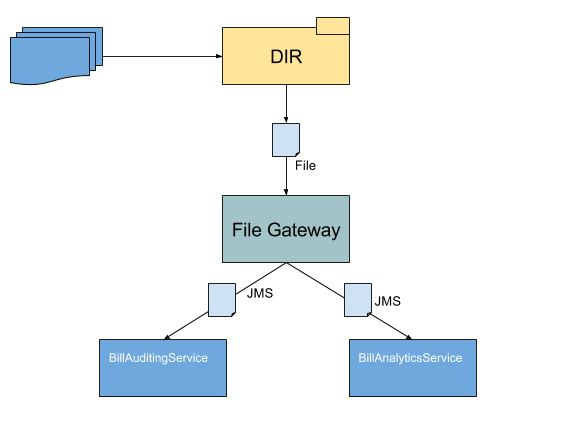
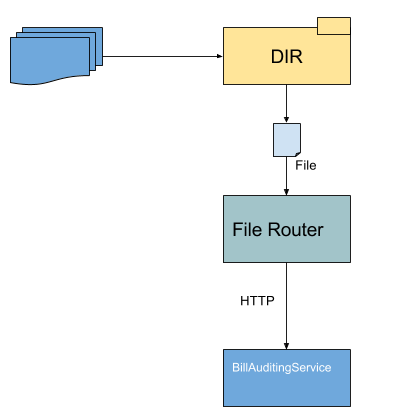

# File Gateway

## Introduction

## What you will learn 

- Listening to incoming file with file connector. 
- Reading file using I/O records API.
- Using JMS topics with Ballerina.

## Scenario - Async Messaging

### Description
XtreamEnergy Inc would wish to incorporate their current file based system with the new services 
"BillAuditingService" and "BillAnalyticsService".

- Currently XtreamEnergy maintains all the billing information of users in a spreadsheet. The records of each user is 
exported to a CSV file monthly. Each record in the CSV contains the fields name,id and the amount paid by the user in 
the relevant month.   
- BillAuditingService and BillAnalyticsService expects to process each record of users separately. Both the services 
expect user information in the following json format

```
 {
    "name":<<NameOfUser>>,
    "id":<<IdOfUser>>,
    "amount":<<AmountPaid>>
 }
``` 



### Solution
The CSV file could be read using file connector. Each record in the CSV should be scattered and transformed into a 
json that is expected by the services ("BillAuditingService" and "BillAnalyticsService"). The transformed message 
will be placed into a JMS topic. Where two consumers will bind to the topic to receive and distribute the messages 
between "BillAuditingService" and "BillAnalyticsService".

### Building the Scenario

In order to build the scenario we would need the following,

- Service which will act as the 
[BillAuditingService](services/samples/billing/BillAuditingService.bal)  
- Service which will act as the
[BillAnalyticsService](services/samples/billing/BillAnalyticsService.bal) 
- Service which will act as the gateway, which will read the CSV file, scatter the records and dispatch it to topic.
[FileProcessingGateway](services/samples/billing/FileProcessingGateway.bal) 
- JMS service which will consume from topic and dispatch the request to BillAuditingService.
[BillAuditingConsumer](services/samples/billing/BillAuditingConsumer.bal)
- JMS service which will consume from topic and dispatch the request to BillAnalyticsService.
[BillAnalyticsConsumer](services/samples/billing/BillAnalyticsConsumer.bal)

Composing the above services billing.balx was created.

#### Generating a balx

Currently balx is generated through ballerina-tools distribution which could be located in 
[ballerina-tools](https://ballerinalang.org/downloads/)
.Please follow the instructions in the site to setup ballerina-tools in the environment. 

Currently EI includes only ballerina runtime, hence EI will not have Out of Box (OOB) support for composing a balx. 
Ballerina tools pertaining to EI would be included in the future releases. 

If it's intended to modify the source please refer section "modifying the source".

### Testing Scenario

#### Sample Setup

1. Start message broker by running the following command,

bin$ ./broker.sh

2. Deploy the billing service by running the following command,
 
bin$ ./integrator.sh ../samples/file-gateway/billing.balx

#### Modifying the source

If it's intended to modify the existing samples following could be done,

1. As elaborated in the section "Building the Scenario", the relevant source could be found
2. Modify the source as expected 
3. Once modified in order to execute the scenario the following could be done

The services related to async-messaging-patterns could be executed in the following manner,

- Navigate to the directory <EI_HOME>/samples/file-gateway/services
- Execute the following,

samples/file-gateway/services$ ../../../bin/integrator.sh run samples/billing

The above operation will be similar to running billing.balx   

#### Invoking the Service

1. Navigate to ../samples/file-gateway/resources directory 
2. Copy the file Jan_2018_bills.csv to ../samples/file-gateway/resources/bills folder (given that the 
FileProcessingGateway service listens to "bills" directory).

#### Observations 

The following log will be displayed in the ballerina instance,

```
../samples/file-gateway/resources/bills/Jan_2018_bills.csv
Analytics service received the request: {"name":"User3","id":"49484","amount":"3849"}
Analytics service received the request: {"name":"User1","id":"19292","amount":"2000"}
Analytics service received the request: {"name":"User2","id":"48944","amount":"4000"}
Audit service received the request: {"name":"User2","id":"48944","amount":"4000"}
Audit service received the request: {"name":"User3","id":"49484","amount":"3849"}
Audit service received the request: {"name":"User1","id":"19292","amount":"2000"}
```

Given that there're 3 users in the CSV record each users records is processed by both "BillAnalyticsService" and 
"BillAuditingService"

## Scenario - Routing File Content

### Description
XtreamEnergy Inc was requested to perform another operation to connect with "NewConnectionProcessingService". The 
criteria is,

1. Current file based system will include a file to the directory which will be in the following format,

```
<<Status>>
{"user":"<<NameOfUser","connectionId":"<<IdOfUser>>"}
```

2. The status will be either "Approved" or "Rejected".
3. If the status is "Approved" the relevant json message should be forwarded to "NewConnectionProcessingService". If 
the status is "Rejected" the information should not be processed any further.



### Solution

Once a file is placed under a local directory, read the first 8 characters of the file. This will indicate whether 
the content is approved or rejected. If the content is rejected if will be pointless to process the file any further.
If the content is approved read the remaining payload and dispatch the content to the corresponding service.

### Building the Scenario

In order to build the scenario we would need the following,

- Service which will act as the
[NewConnectionProcessingService](services/samples/routing/NewConnectionProcessingService.bal)
- Service which will act as the router, which will read the content of the directory, filter the approved files and 
dispatch them to the service 
[FileProcessingRouter](services/samples/routing/FileProcessingRouter.bal) 

### Testing the Scenario

#### Sample Setup

1. Deploy the routing service by executing the following command,

bin$ ./integrator.sh ../samples/file-gateway/routing.balx

#### Modifying the source

If it's intended to modify the existing samples following could be done,

1. As elaborated in the section "Building the Scenario", the relevant source could be found
2. Modify the source as expected 
3. Once modified in order to execute the scenario the following could be done

The services related to async-messaging-patterns could be executed in the following manner,

- Navigate to the directory <EI_HOME>/samples/file-gateway/services
- Execute the following,

samples/file-gateway/services$ ../../../bin/integrator.sh run samples/routing

The above operation will be similar to running routing.balx   

#### Invoking the Service 

1. Navigate to ../samples/file-gateway/resources directory 
2. Copy the connection_req1 to ../samples/file-gateway/resources/connections folder (given that the 
FileProcessingRouter service listens to "connections" directory).

The following log will be indicated,

```
../samples/file-gateway/resources/connections/connection_req1.txt will not be processed any further, 
since this is rejected.
```

3. Copy the connection_req2 to ../samples/file-gateway/resources/connections directory.

The following log will be indicated,

```
New connection request received {"user":"bar","connectionId":"3737374"}
```