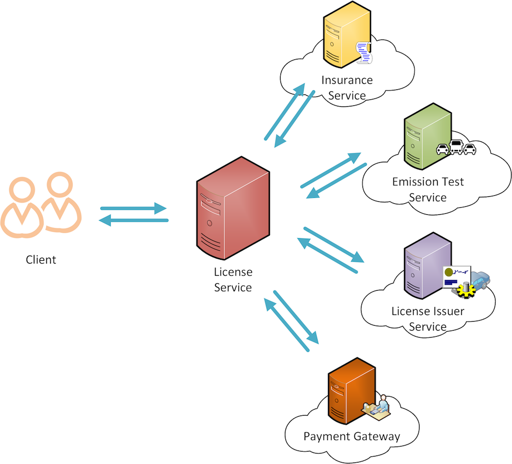

# Services, Applications and Data Composition Scenario

## Scenario



Note:
This is an extended version of "Vehicle Revenue License Service Orchesestration" scenario.
In addition the Service Orchestration capabilities described in that sample,
here we are looking into the data composition functionality too.

This scenario is about an online vehicle license renewal system. 
In some countries, vehicle owners have to renew their vehicle revenue license annually. 
To renew the license, the vehicle should have a valid insurance policy, a valid emission test certificate, 
and a credit card to make the payment.
The system is built by orchestrating several services.

Client provides the vehicle registration number and the credit card details in the request.
Service should validate the validity of certificates by calling relevent services.
Thereafter Payment Gateway get called to make the payment and finally LicenseIssuer service get called to issue the license.

Further service should provide a way for clients to see the current status of vehicle revenue license.


## Services

Our main focus in this sample is on Revenue License Service. 
However for simplicity other sample backend services are also written in ballerina.
Please note that these are just dummy services implemented to mock a specific functionality.

### Insurance Service
Insurance service takes the vehicle registration number as the input data and gives out whether the vehicle has a valid insurance policy or not.

### Emission Test Service
This service takes the vehicle registration number as the input data and gives out whether vehicle has a valid emission test certificate.

### License Issuer Service

This is responsible for issuing the license.

### Payment Gateway
This service handles the payment.

## Orchestrating Services
Revenue License Service orchestrates all the above services and offers a service which can be used to renew the license.


## Requirements

This sample uses MySQL DB. Before running the sample copy the MySQL JDBC driver to following location
 ```
 <EI_HOME>/wso2/ballerina/bre/lib folder
 ```
Change the DB connection parameters as required.

Use the orchestrartion-data.sql file located at resources directory to create required database schema, tables and data.


## Building the scenario

Revenue License Service contains three Resources. They are validateCertsResource, checkStatusResource and licenseResource .
validateCertsResource offers a way to the user to check whether they have valid certificates by themselves before submitting a request to renew the license. 
licenseResource provides the main functionality of the service. 
Both these resources need to call the Emission Test Service and the Insurance Service to get the certificates validated.
So validation logic is implemented in a function (named as validateCertificates) so that both resouces can reuse the same code segment.

Emission Test Service and Insurance Service can be invoked in parallel as they are mutually exclusive.
 Fork-Join and Worker cocepts in ballerina is used for that purpose.

Rest of the service invocations need to be done sequentially as output of the one service invocation is required for the next service invocation.

To check the status of the vehicle license, we need to fetch data from several database tables.
in 'checkStatusResource' you will notice that data extracted from 3 tables are composed into a single message.

## Test the scenario

## How to run the sample

Change DB connection parameters in vehicleInfoDB endpoint of RevenueLicenseService.bal located at
<EI_HOME>/samples/service-orchestration-with-data-composition/services/samples/orchestration

```
 endpoint<sql:ClientConnector> vehicleInfoDB {
        create sql:ClientConnector(
        sql:MYSQL, "localhost", 3306, "VehicleRegistry", "root", "root123", {maximumPoolSize:5});
    }
```

Goto <EI_HOME>/samples/service-orchestration-with-data-composition/services

Execute following command to compile and run the ballerina program.
```
samples/service-orchestration-with-data-composition/services$ ../../../../bin/integrator.sh samples/orchestration/
```

## Invoking the service


### Check status

Invoke the service using cURL as follows

```
curl -v http://localhost:9090/license/checkStatus/CAV-5527
```

You should get something similar to following as the output.
```
{"VehicleNumber":"1NZ-821376","VehicleClass":"MOTOR_CAR","Make":"TOYOTA","Model":"PREMIO","LicenseExpiry":"05-02-2018","LicenseFee":30}
```


### Renew the License


Create a payload.json file with the following content.
```
{
   "Vehicle":{
      "ID":"CAV-5527"
   },
   "card":{
      "no":"1234098618781768",
      "cvv":"123"
   }
}
```
Invoke the service using cURL as follows
```
curl -v http://localhost:9090/license/renew -d@payload.json -H"Content-Type: application/json"
```

You should get something similar to following as the output.
```
{"License Certificate":"XLO1029302020","Vehicle ID":"CAV-5527"}
```

### Modifying the code

All the services related to this sample is located at <EI_HOME>samples/service-orchestration/services directory.

Following are the available ballerina program files.

[EmissionTestService.bal](services/samples/orchestration/EmissionTestService.bal)

[InsuranceService.bal](services/samples/orchestration/InsuranceService.bal)

[LicenseIssuerService.bal](services/samples/orchestration/LicenseIssuerService.bal)

[PaymentGateway.bal](services/samples/orchestration/PaymentGateway.bal)


These four services are just dummy services which mock the functionality of a backend service.

[RevenueLicenseService.bal](services/samples/orchestration/RevenueLicenseService.bal) is the main service which we focus on this sample.

Please note that these files are located at samples/orchestration sub-directory inside the service directory
as all these services belongs to the samples.router package.

We can simply edit the configurations as you prefer and execute the sample again with modified
content with the following command.

```
samples/service-orchestration-with-data-composition/services$ ../../../bin/integrator.sh samples/orchestration
```

We can test the sample by executing the same set of steps given above.