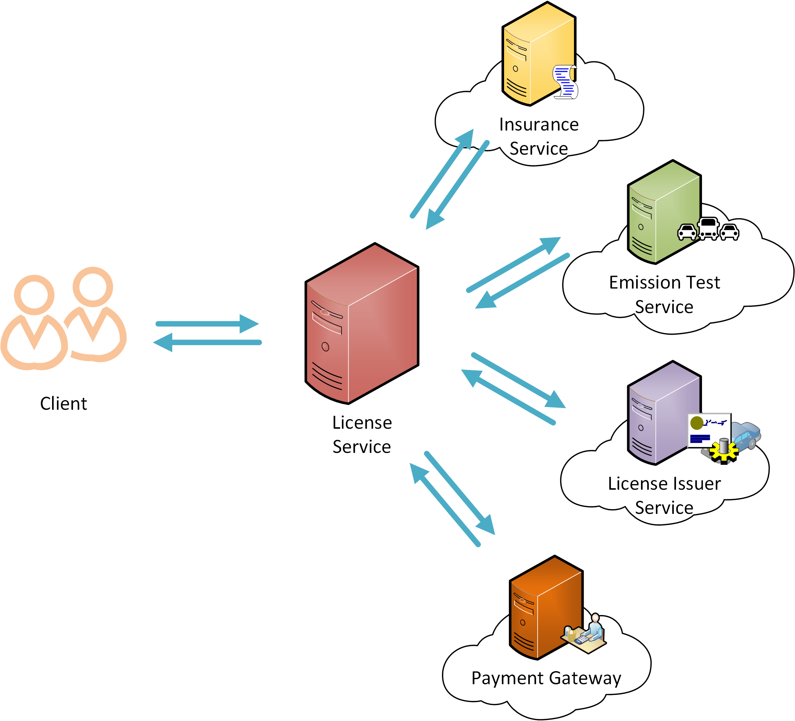

# Service Orchestration




This scenario is about an online vehicle license renewal system. 
In some countries, vehicle owners have to renew their vehicle revenue license annually. 
To renew the license, the vehicle should have a valid insurance policy, a valid emission test certificate, 
and a credit card to make the payment.
The system is built by orchestrating several services.

Client provides the vehicle registration number and the credit card details in the request. Service should validate the validity of certificates by calling relevent services. Thereafter Payment Gateway get called to make the payment and finally LicenseIssuer service get called to issue the license. 

## Services

Our main focus in this sample is on Revenue License Service. 
However for simplicity other sample backend services are also written in ballerina.
Please note that these are just dummy services implemented to mock a specific functionality.

### Insurance Service
Insurance service takes the vehicle registration number as the input data and gives out whether the vehicle has a valid insurance policy or not.

### Emission Test Service
This service takes the vehicle registration number as the input data and gives out whether vehicle has a valid emission test certificate.

### License Issuer Service

This is responsible for issuing the license.

### Payment Gateway
This service handles the payment.

## Orchestrating Services
Revenue License Service orchestrates all the above services and offers a service which can be used to renew the license.

Revenue License Service contains two Resources. They are validateCertsResource and licenseResource.
validateCertsResource offers a way to the user to check whether they have valid certificates by themselves before submitting a request to renew the license. 
licenseResource provides the main functionality of the service. 
Both these resources need to call the Emission Test Service and the Insurance Service to get the certificates validated. So validation logic is implemented in a function (named as validateCertificates) so that both resouces can reuse the same code segment.

Emission Test Service and Insurance Service can be invoked in parallel as they are mutually exclusive. Fork-Join and Worker cocepts in ballerina is used for that purpose. 

Rest of the service invocations need to be done sequentially as output of the one service invocation is required for the next service invocation.

## How to run the sample

bin$ ./integrator.sh ../samples/service-orchestration/orchestration.balx

## Invoking the service
Create a payload.json file with the following content.
```
{
   "Vehicle":{
      "ID":"11111"
   },
   "card":{
      "no":"1234098618781768",
      "cvv":"123"
   }
}
```
Invoke the service using cURL as follows
```
curl -v http://localhost:9090/license/renew -d@payload.json -H"Content-Type: application/json"
```

You should get something similar to following as the output.
```
{"License Certificate":"XLO1029302020","Vehicle ID":"11111"}
```


