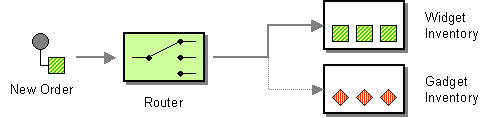

## Introduction

The Content-Based Router (CBR) reads the content of a message and routes it to a specific recipient based on its content. This approach is useful when an implementation of a specific logical function is distributed across multiple physical systems.





## Business use case narrative

The example scenario depicts an inventory for stocks and illustrates how the Content-Based Router routes a message based on the message content. When the router receives a stock request, it reads the content of the request. If the request is made for foo, the request is routed to the foo stock inventory service. If the request is for bar, it is routed to the bar stock inventory service. 

## Persona

Integration developer

## Implementation

### Prerequisites

- WSO2 EI Tooling installed in the development environment.
- WSO2 EI distribution installed in the environment.

### Development 

The diagram below depicts how to simulate the above business scenario using WSO2 ESB.


#### Sample configuration

```xml
<!-- The example use of content based routing -->
<definitions xmlns="http://ws.apache.org/ns/synapse">
    <!-- The service which the sender will be invoking -->
    <proxy name="ContentBasedRoutingProxy">
        <target>
           <!-- When a request arrives the following sequence will be followed -->   
           <inSequence>
             <!-- The content of the incoming message will be isolated -->
             <switch source="//m0:getQuote/m0:request/m0:symbol" xmlns:m0="http://services.samples">
                    <!-- The isolated content will be filtered -->
                    <case regex="foo">
                        <!-- Will Route the content to the appropriate destination -->  
                        <send>
                             <endpoint>
                                 <address uri="http://localhost:9001/services/SimpleStockQuoteService"/>
                             </endpoint>
                        </send>
                    </case>
                    <case regex="bar">
                        <send>
                            <endpoint>
                                <address uri="http://localhost:9002/services/SimpleStockQuoteService"/>
                            </endpoint>
                        </send>
                    </case>
                    <default>
                     <!-- it is possible to assign the result of an XPath expression as well -->
                    <property name="symbol" expression="fn:concat('Normal Stock - ', //m0:getQuote/m0:request/m0:symbol)" xmlns:m0="http://services.samples"/>
                    </default>
            </switch>      
            </inSequence>
            <outSequence>
                <send/>
            </outSequence>
        </target>     
    </proxy>
</definitions>
```


### Deployment

### Testing and acceptance criteria

## See also