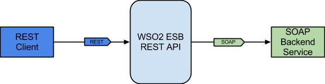

# 1.1.1 Converting SOAP message to JSON using PayloadFactory mediator





## When to use this approach

The most common message transformation use case is reconstructing the entire message payload according to the required format of the service/client. 
We can use the PayloadFactory Mediator to do the transformation in this use case, if we know that the structure of the new payload is simple, which means the message format is fixed, and only a few parameters are extracted from the original message. 
If the original message has repetitive segments and if you want to transform each of those segment into a new format with repetitive segments, you can use the For-Each Mediator together with the PayloadFactory mediator.

## Sample use case
Exposing a SOAP web service as a REST API by doing a SOAP to JSON conversion. 

## Prerequisites
A REST client like cURL to invoke the ESB API.

## Development 

### Sample configuration

REST API Configuration

The API resource is configured with an URI-Template and parameterized to get the ZIP code. A request payload is constructed with a given zip code. Also, ‘SOAPAction’ which is a mandatory header for SOAP 1.1 is set before invoking the endpoint. Once the response is received, it is sent back to the client by converting the XML message to a JSON message using the PayloadFactory mediator.

```xml
<?xml version="1.0" encoding="UTF-8"?>
<api context="/city" name="CityInformationAPI" xmlns="http://ws.apache.org/ns/synapse">
    <resource methods="GET" uri-template="/lookup/{zipCode}">
        <inSequence>
            <payloadFactory description="Build SOAP request payload" media-type="xml">
                <format>
                    <tem:LookupCity xmlns:tem="http://tempuri.org">
                        <tem:zip>$1</tem:zip>
                    </tem:LookupCity>
                </format>
                <args>
                    <arg evaluator="xml" expression="get-property('uri.var.zipCode')"/>
                </args>
            </payloadFactory>
            <header description="Set SOAPAction header" name="Action" scope="default" value="http://tempuri.org/SOAP.Demo.LookupCity"/>
            <property action="remove" description="Avoid appending resource to endpoint URL" name="REST_URL_POSTFIX" scope="axis2"/>
            <send description="Send Request Payload to SOAP endpoint">
                <endpoint key="CityLookupEP"/>
            </send>
        </inSequence>
        <outSequence>
            <payloadFactory description="Build Response Payload in JSON format" media-type="json">
                <format>{
  "LookupCityResult": {
    "City": "$1",
    "State": "$2",
    "Zip": $3
  }
}</format>
                <args>
                    <arg evaluator="xml" expression="//tem:LookupCityResult/tem:City" xmlns:tem="http://tempuri.org"/>
                    <arg evaluator="xml" expression="//tem:LookupCityResult/tem:State" xmlns:tem="http://tempuri.org"/>
                    <arg evaluator="xml" expression="//tem:LookupCityResult/tem:Zip" xmlns:tem="http://tempuri.org"/>
                </args>
            </payloadFactory>
            <respond description="Respond to client"/>
        </outSequence>
        <faultSequence>
            <payloadFactory description="" media-type="json">
                <format>{
  "Error": {
    "message": "Error while processing the request",
    "code": "$1",
    "description": "$2"
  }
}</format>
                <args>
                    <arg evaluator="xml" expression="$ctx:ERROR_CODE"/>
                    <arg evaluator="xml" expression="$ctx:ERROR_MESSAGE"/>
                </args>
            </payloadFactory>
            <respond/>
        </faultSequence>
    </resource>
</api>
```


Endpoint Configuration

```xml
<endpoint name="CityLookupEP" xmlns="http://ws.apache.org/ns/synapse">
    <address format="soap11" uri="http://www.crcind.com/csp/samples/SOAP.Demo.cls"/>
</endpoint>
```


### Deployment
Single node ESB deployment.
<<Need to give instructions on how to deploy>> 


### Testing and acceptance criteria
    
Invoke the service with the following request. Use an HTTP client like cURL.

```xml
curl http://localhost:8280/city/lookup/60601
```

- Processing expected SOAP message (Happy path)
- Handling malformed SOAP message
- Handling well formed SOAP message with incomplete information


### Observability
N/A

### Maintenance tips
N/A

### APIs
N/A

### See Also

